# **The Angel's Share**

As part of my Milestone 4 project with [Code Institute]( https://codeinstitute.net/), I was challenged with using the [Django Framework]( https://www.djangoproject.com/start/overview/) to build a full stack website which is based around business logic used to control a centrally-owned dataset. 

I decided to build a whiskey subscription service called the **Angel's Share**. The name for the brand was chosen after the Angel’s take their cut from every barrel of distilled spirits. In the simplest of terms, the Angel’s Share is the amount of distilled spirits lost to evaporation from the barrel or cask into the air as the whiskey ages.  

The Angel’s Share website, provides three whiskey club subscriptions to choose from: Irish Whiskey, Scottish Whiskey and American Bourbon. Club members can choose between a 3 month, 6 month or a 12 month subscription, with a different bottle of whiskey being delivered each month. 
The various types of whiskey’s selected by the Angel’s Share, range from classic whiskeys everybody is familiar with, to craft specials that are provided exclusively to the Angel’s Share from the distiller. 

The Angel’s Share is perfect for people who have a keen interest in whiskey, or those who want to get started in building a whiskey collection. The Angel’s Share is also a perfect gift option.

## **User Experience (UX)**

-   ### User Stories

    - As a Shopper 

        - As a user I want to be able to view all the product’s/service’s available to purchase from the Angel’s Share. 
            - Choose Your Poison page – users have the option to select between the three whiskey clubs (Irish, Scottish and Bourbon Whiskey)

        - As a User I want to get more information on each whiskey club/product when I click on the relevant club. 
            - Reason for Whiskey selected page with more detailed information like description, rating , taste notes etc. 

        - As a shopper I want to see the different price options for the various clubs. 
            - ‘Choose your hit’ section users can see the price of getting the Angel’s Drop package for 3/6 and 12 month subscriptions. 

        - As a user I want to be able to see an ‘About Page’, so I can understand the type of company the Angel’s Breath is. 
            - Reason for About page.

    - Registration 
        
        - As a user who wants to subscribe to one of the Angel’s Drops whiskey clubs, I would like to be able to register an account easily so I can checkout quicker and receive special offers. 
            - Reason for login/registration. 

        - As a registered user I want to be able to login and logout quickly. 

        - As a one-time user I want to be able to make a once off purchase without signing up. 
            - If purchasing the whiskey subscription as a gift, user’s don’t need to sign up. 

    - Purchasing & Checkout 
        
        - As a user I want to be able to view my shopping bag once I have selected a product, so I can evaluate the details of my purchase and the total cost. 
            - Reason for the shopping bag. 

        - As a user I want to easily enter my payment and shipping information and feel my transaction is safe and secure.
            - Users are brought to the secure checkout and payment is handled by stripe to guarantee a secure transaction. 

    - Admin and Store Management 
        - As a website developer I want to be able to use the basic CRUD functionality to be able to add, edit and delete products/services on the website. 

-   ### **WIREFRAMES**

After reading the project brief i formulated a idea and jotted down notes and rough sketches on pen and paper. These ideas evolved into creating user stories which helped me formulate a plan to draw up some wireframes.
I used [Balsamic](https://balsamiq.com/) to build the wireframes. I created mockups for desktop, tablet and mobile viewports, so i could have an idea of what my website would look like, and i could follow a plan to avoid scope creep.

Desktop Wireframes <strong>(Click dropdown for images)</strong>

  </a>

  </a>

  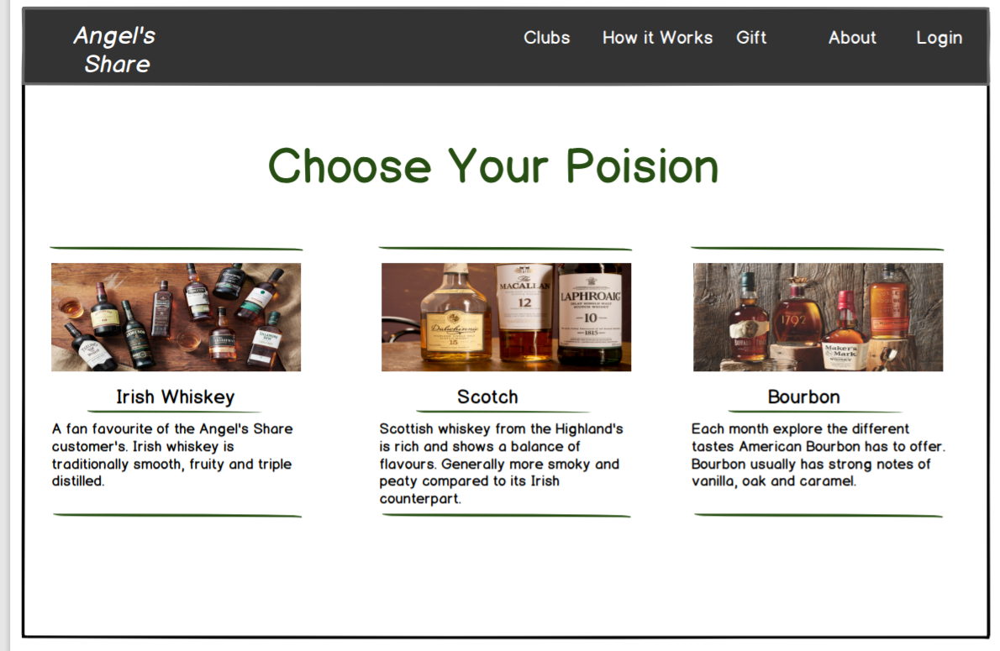</a>

  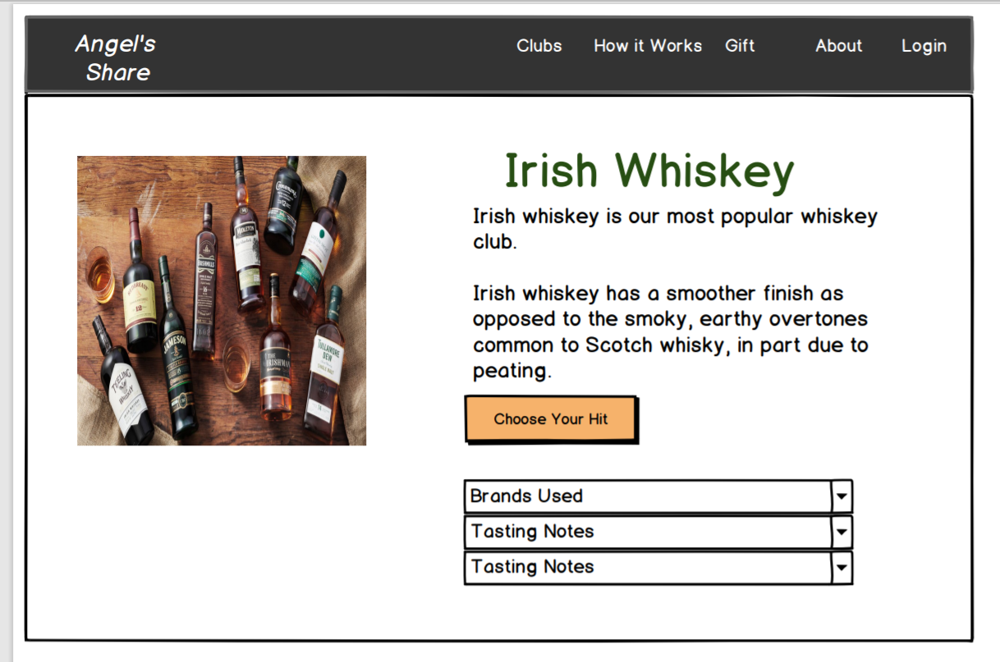</a>

  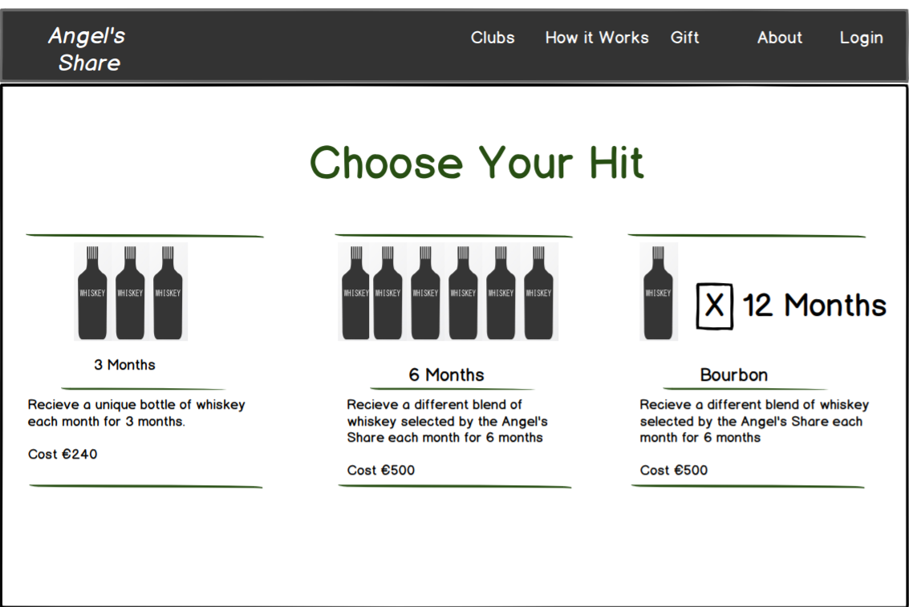</a>

  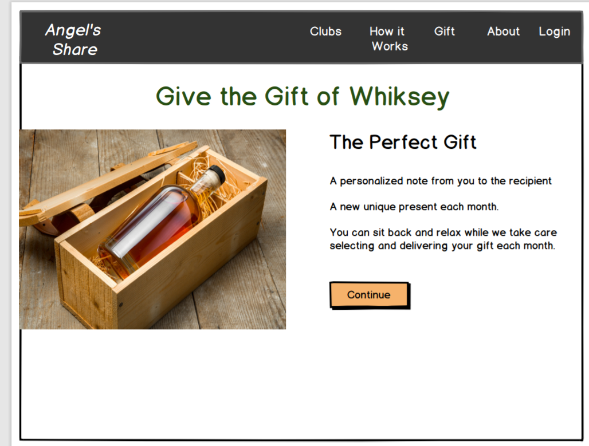</a>

  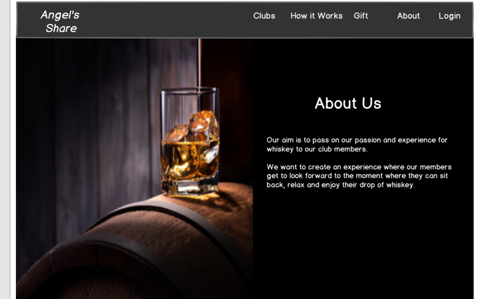</a>

  </a>

  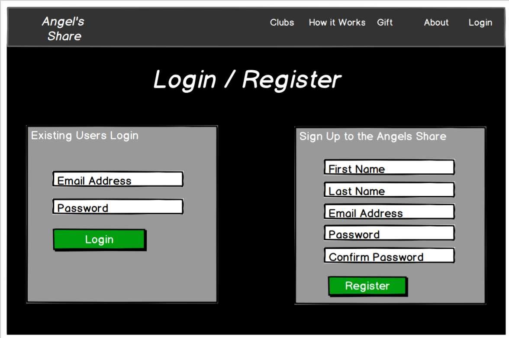</a>

Tablet Wireframes <strong>(Click dropdown for images)</strong>

  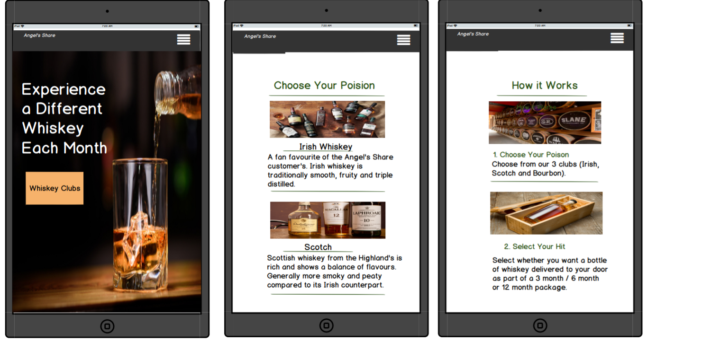</a>

  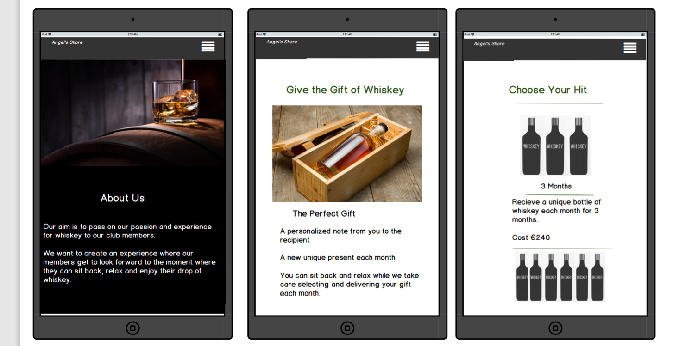</a>

  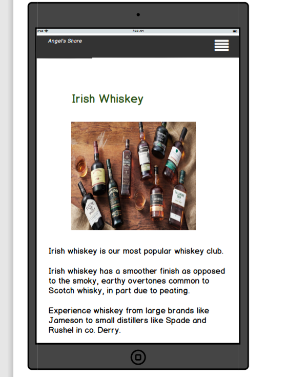</a>

Phone Wireframes <strong>(Click dropdown for images)</strong>

  </a>

  </a>

## **Design**

### Framework
I used Bootstrap 4 to build the framework of the website. Bootstrap was the main tool frame responsible for making the Angel's Share website responsive. This means the website automatically resizes itself to look good on all devices, be it mobile, tablet, laptop or desktop.

### Colour Scheme

- **Black** - Black is the dominant colour throughout this website. Black is elegant, sophisticated and it implies a premium brand. The black background gives prominence to the content on the site. I thought the colour black fitted well within the alcohol and whiskey industry in portraying the Angel's Share as a premium brand. 

- **White** - On some of the pages there is a white background as opposed to the dominant black. The reason being i wanted to go for a clean look that doesn't distract the user from the call to action, be it login/registration or selcting the specific whiskey club or subscription. 

- **Dark Green** - Dark green was used mostly in the headings and borders of this site. I felt it contrasted well to stand out and green is assoicated with the celtic origins whiskey. 

- **Light Orange** - The light orange colour is consistently used across the website's call to action buttons. This shade of orange is similar to the amber colour of whiskey. 

#### List of the other colours used throughout the website: 

- #232323 - (Charcoal) 

- #6c757d (Navy Grey) 

- #aab7c4 (Light Grey)

- #17a268 (turquoise)

### Typography
The “Montserrat” font is the font used for all the headings and the “Lato” font is the font used for the body of the website. Sans serif is set as the fallback font in case for any reason the font isn't being imported into the site correctly.

### Imagery
Imagery is a reoccurring theme throughout the website. I felt images played a vital role in influencing a users decision in the alcohol industry. 
The Hero image especially works well in drawing the user in and given the website a very modern feel.

### Logo 
I created the logo on [Tailor Brands]( https://www.tailorbrands.com/). Although it is a paid service i feel the level of detail and quality of the template they use is worth it. I felt the image is clean, elegant and is positioned well within the whiskey market.  
<h2 align="center"></h2>

## **Layout**

### Homepage

The homepage sets up to be enticing while at the same time obvious to the user the purpose of the website. The heading "Experience a different whiskey each month before the angel's take it", prompts the user to click the 'Whiskey Clubs' button. 

- Call to action: 

    - Whiskey Clubs Button - upon clicking users are brought to the 'Choose Your Poison Page'.

Homepage <strong>(Click dropdown for images)</strong>

  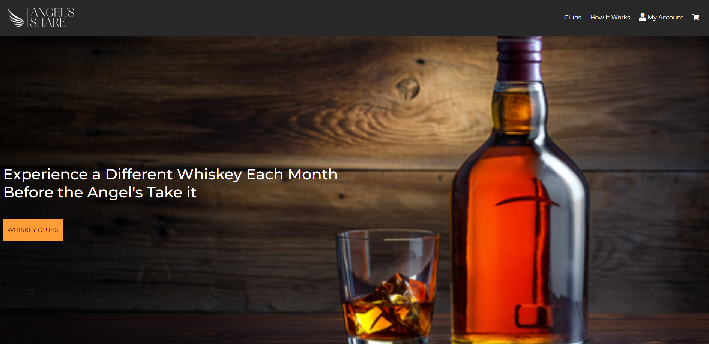</a>

  

---
### Whiskey Club Selected Page / Choose Your Poison
Once the user clicks the select button on the bottom of the card deck on the Whiskey Clubs page, 
they are brought to that specific whiskey's details page. 
This page is the first step in the process in signing up to an 'Angel's Share' Whiskey Club. 
The images were specifically chosen as they showcase some of the most famous whiskey brands from each club.

Choose Your Poison Page <strong>(Click dropdown for images)</strong>

  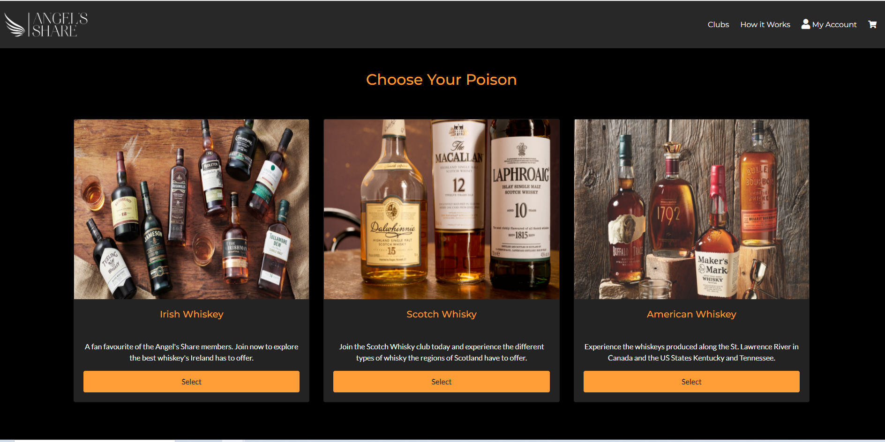</a>

  

---
### Whiskey Selected Page
This page is a very descriptive page on the whiskey selected by the user. This page explains the history, origins and distilling methods associated with that specific whiskey club. 

Whiskey Selected <strong>(Click dropdown for images)</strong>

  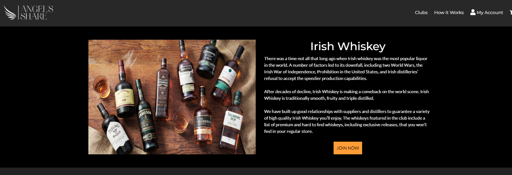</a>

  

Tasting notes are also included to allow users evaluate in their own mind which whiskey would best suit them based on their preferences or biases. 

Tasting Notes <strong>(Click dropdown for images)</strong>

  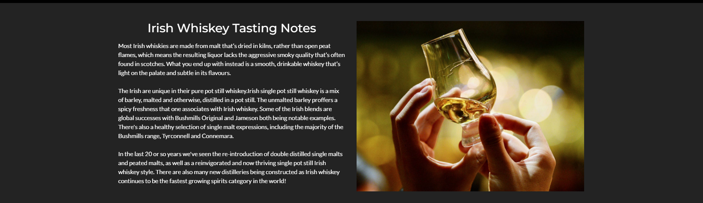</a>

  

the first two sections just mentioned differ based on the whiskey selected. This whiskey package section however is the exact same for all three whiskey clubs. 
This section just briefly explains the added extras aside from the bottle of whiskey the **Angel's Share** members receive each month;

- Flavour profiles and tasting notes for each bottle.
- Tutorial on how to recognise different whiskey blends.
- Whiskey Production Techniques
- Expert evaluations and commentary on bottles.

Whiskey Package <strong>(Click dropdown for images)</strong>

  </a>

  

Tasting Notes <strong>(Click dropdown for images)</strong>

  </a>

  

---
### Choose Your Hit
This page has a similar layout to the 'Choose Your Poison' Page. This is the final step in the choosing the whiskey club you want to sign up to before it's added to the cart.

Choose Your Hit <strong>(Click dropdown for images)</strong>

  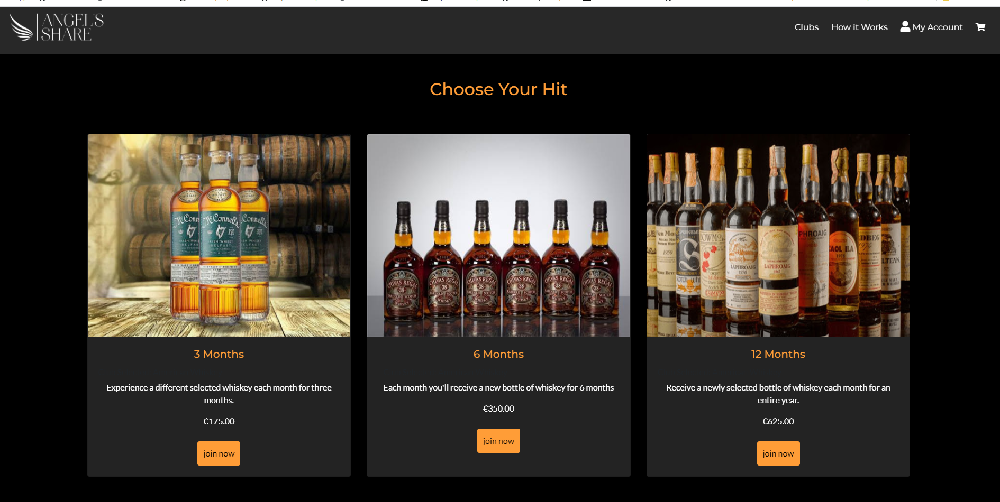</a>

  

---
### How It Works 
Users may be skeptical or curious as to what the Angel's Share is or what it entails, and the 'How it Works' page is there to strengthen the message of what the Angel's Share is all about.
This page uses icons and images to get the message across in a clear manner. The combination of images and icons also turns a regular mundane about page into an eye catching page.

How it Works <strong>(Click dropdown for images)</strong>

  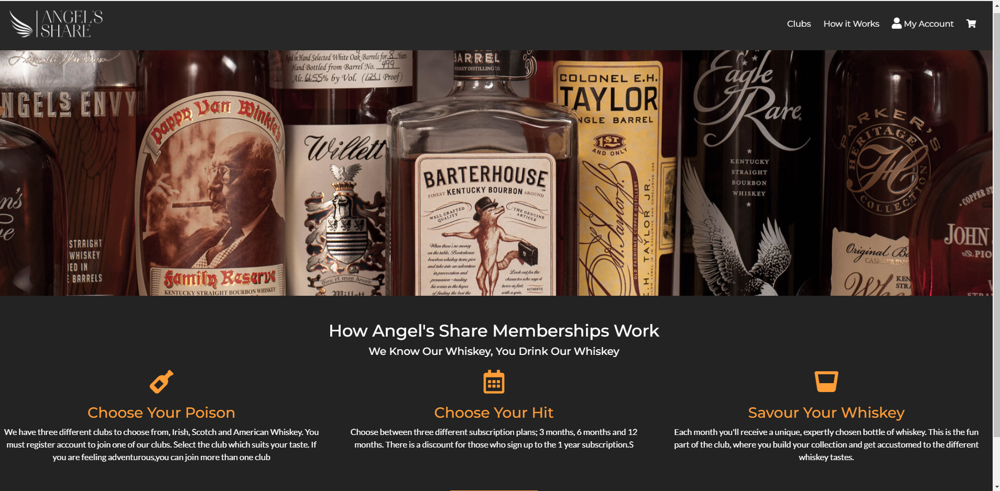</a>

  

---
### Shopping Cart / Profile / Order page / Checkout page / Authentication pages
for the Shopping Cart / Profile / Order page / Checkout page / Authentication pages i decided to keep a clean tidy design. 
The background for all these pages are white and are paired with black font, borders and buttons. 

I felt if i carried on with the same colour theme as i did for the whiskey pages, they may not be as easy to read as the clean white background. 

These pages involve the user either inputting or receiving information which is key to the order transactions, 
so i tried to keep the medium of passing information as neat as possible with no clutter. 

White and black design for information pages <strong>(Click dropdown for images)</strong>

  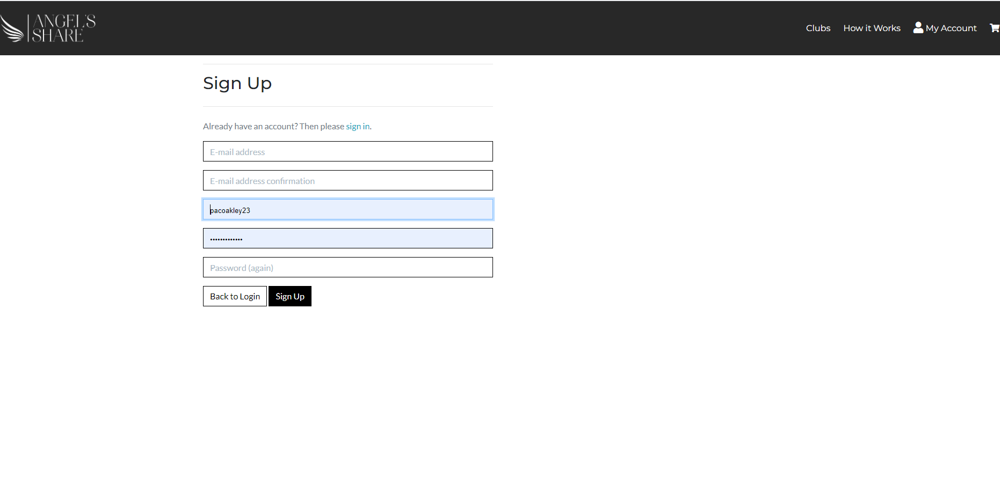</a>

  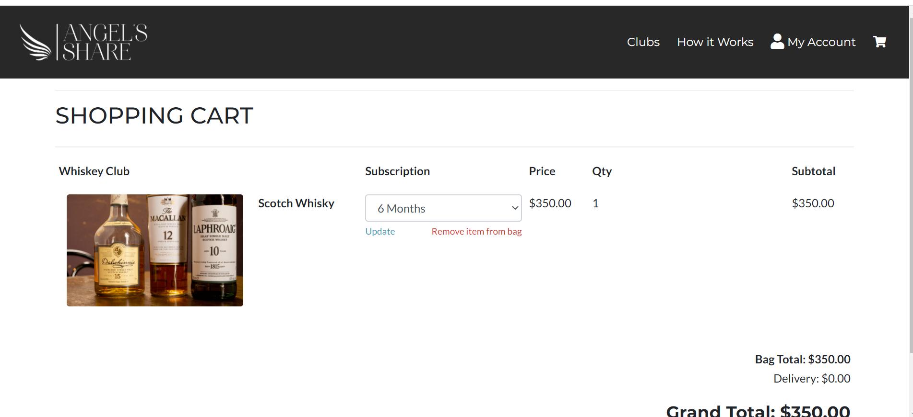</a>

  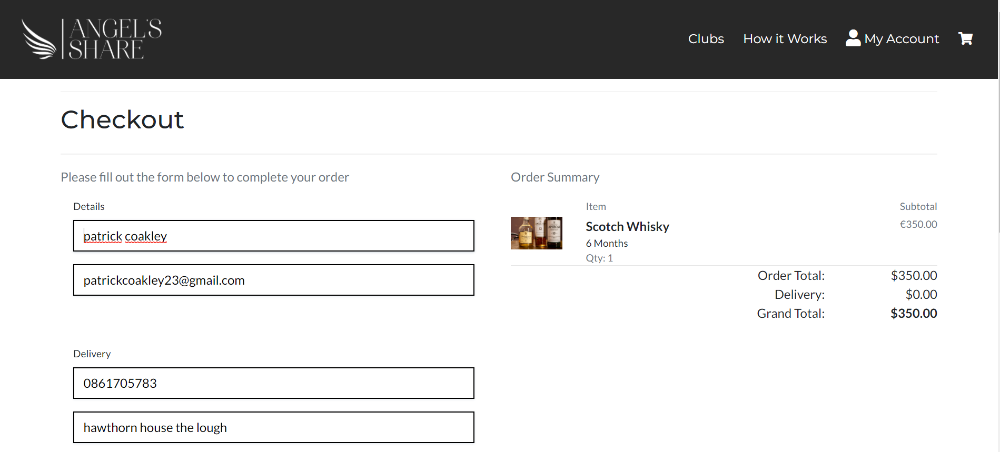</a>

  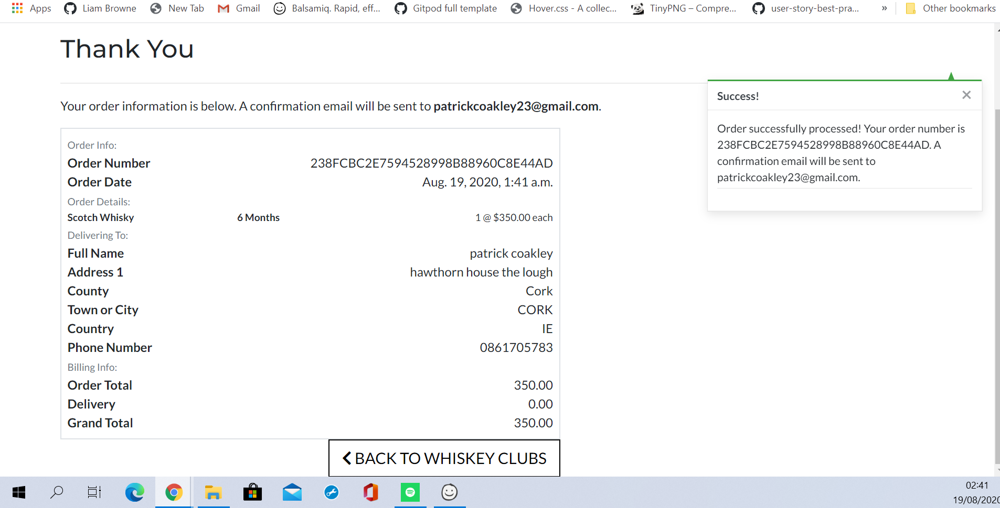</a>

  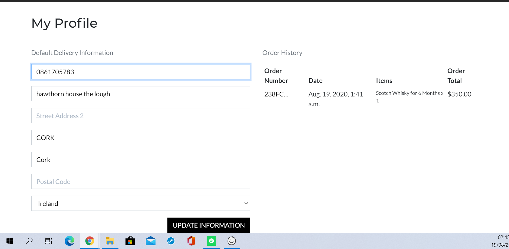</a>

 

---
### 404 Page
I created a customized error page incase a user gets a 404 message.

404 Page <strong>(Click dropdown for images)</strong>

  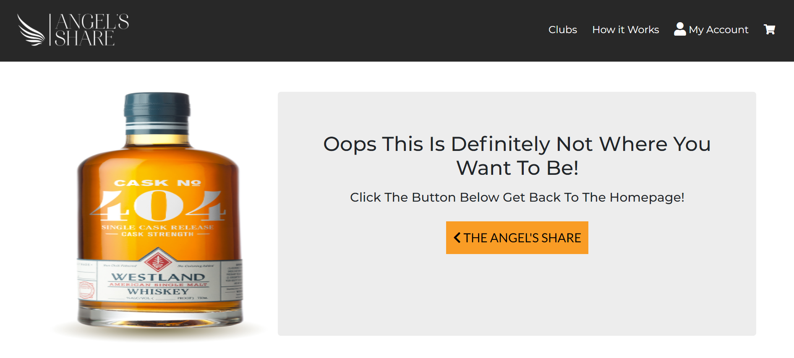</a>

  

---
### Base Template 
The base.html contains the basic layout which is common to all the other templates, and it is from this base template that we extend the layout for other pages.
We modify the parent template(base.html) using the child templates (e.g the pages listed above). The  must be the first tag in the child templates. This tag tells the template engine that this template extends from the parent template or ( base.html ).

We then use Template inheritance eg. 

    
    {& endblock %}

To override the base.html page and add our custom code to the child elements. 

The Base.Html page in this website contains all the relevant links to our bootstrap framework, font awesome, css files, Jquery and other relevant meta tags. The Base.html also sets the template for the navbar and flash messages used throughout the website and the reoccurring css styles like font, colour, background colour etc. 

The navbar is the same across all sites so we only needed to create it once in the base template, and that meant it was made available across the site. 

---
## TECHNOLOGIES

### Languages Used 

1. [HTML5]( https://en.wikipedia.org/wiki/HTML5) - is the standard markup language for documents designed to be displayed in a web browser.
2. [CSS3]( https://en.wikipedia.org/wiki/Cascading_Style_Sheets) - Cascading Style Sheets is a style sheet language used for describing the presentation of a document written in a markup language like HTML.
3. [Python]( https://www.python.org/) - Python is an interpreted, high-level, general-purpose programming language.
4. [Javascript/Jquery]( https://en.wikipedia.org/wiki/JavaScript) - JavaScript is among the most powerful and flexible programming languages of the web. It powers the dynamic behavior on most websites.

 ### Frameworks, Libraries & Programs Used 

1. [Bootstrap 4.4.1:]( https://getbootstrap.com/docs/4.4/getting-started/introduction/)
    - Bootstrap was used to assist with the responsiveness and styling of the website.</li>

2. [Django]( https://www.djangoproject.com/) - Django is a Python-based free and open-source web framework that follows the model-view-controller architectural pattern.
    - Django helped reduced the web application development time. Django allowed me to build custom web applications and also reuse applications i used previously.

3. [SQLite]( https://www.sqlite.org/index.html)
    - SQLite was the database i used in development. By default, Django automatically creates a SQLite database for your project. SQLite is a relational database management system

4. [Google Fonts:]( https://fonts.google.com/)
    - Google fonts were used to import the 'Oswald' font and the 'Open Sans' font into the style.css file which is used on all pages throughout the website.

5. [Font Awesome:]( https://fontawesome.com/)
    - Font Awesome was used on throughout the website to add icons for aesthetic and UX purposes.

6.  [Git]( https://git-scm.com/)
    - Git was used for version control by utilizing the Gitpod terminal to commit to Git and Push to GitHub.

7. [GitHub:]( https://github.com/)
    - GitHub is used to store the projects code after being pushed from Git.

8. [Balsamiq:]( https://balsamiq.com/)
    - Balsamiq was used to create the wireframes during the design process.

9. [PEP8]( http://pep8online.com/)
    - Python style guide checker. PEP8 is a tool to check your Python code against some of the style conventions in PEP 8.

10. [Heroku]( www.heroku.com)
    - Heroku is a cloud platform which was used to host my website.

11. [The W3C Markup Validator]( https://validator.w3.org/) and [W3C CSS Validator Services]( https://jigsaw.w3.org/css-validator/) 
    - Used to validate the HTML and CSS of the project to ensure there were no syntax errors in the project.

12. [PostgreSQL](https://www.postgresql.org/) - PostgreSQL, also known as Postgres, is a free and open-source relational database management system. 
    - Postgres was the databased that was used when my site was hosted on Heroku.

## FEATURES

### CRUD Functionality
Create Read Update and Delete(CRUD)

-**Create** Logged in Users can create an order for a club by choosing their whiskey club and subscription plan. 

Create<strong>(Click dropdown for images)</strong>

  </a>

-**Read** users can see what they have ordered in the cart, and can see their order history in their profile page. 

Read<strong>(Click dropdown for images)</strong>

  </a>
  </a>

-**Update** After adding subscription plans to their shopping cart, whilst in the shopping cart, users can change their subscription plan they are about to purchase by selecting the dropdown and pressing the update button. 

 
Update<strong>(Click dropdown for images)</strong>

  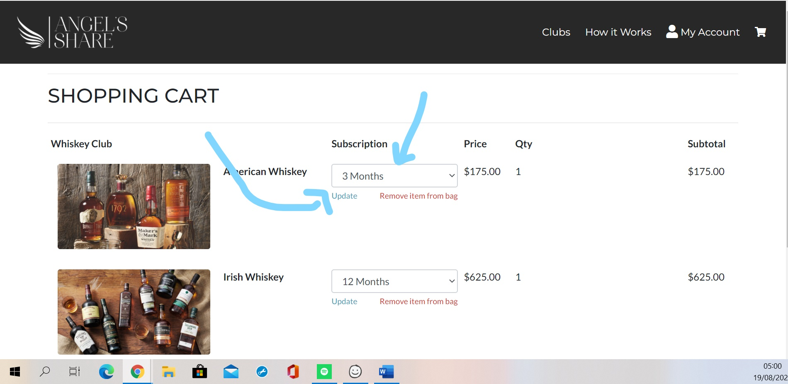</a>

-**Delete** Similarly to the update function, whilst in the shopping cart, users can delete orders from their cart. 

Delete<strong>(Click dropdown for images)</strong>

  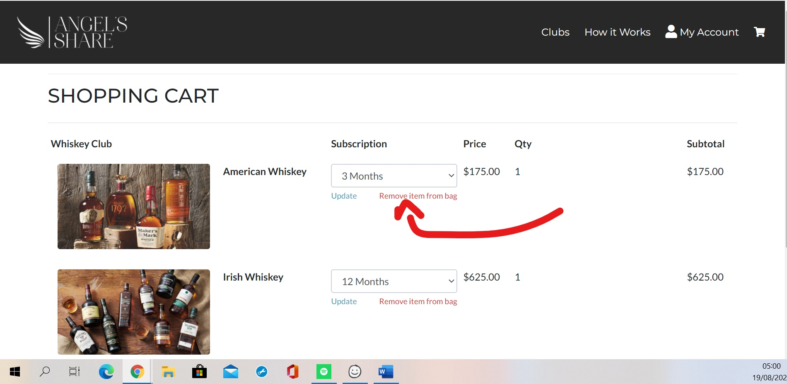</a>

### Forms
There are two forms on this website which are interlinked and allow users to create and edit models in the backend. Users can create a profile form and save the information which will pre populate the order information the next time they make an order. And on the reverse side, when a user is making an order, they can save the order information to update the profile model. 
Users previous orders are also stored in their profile, so they can keep track of their subscriptions. 

Profile<strong>(Click dropdown for images)</strong>

  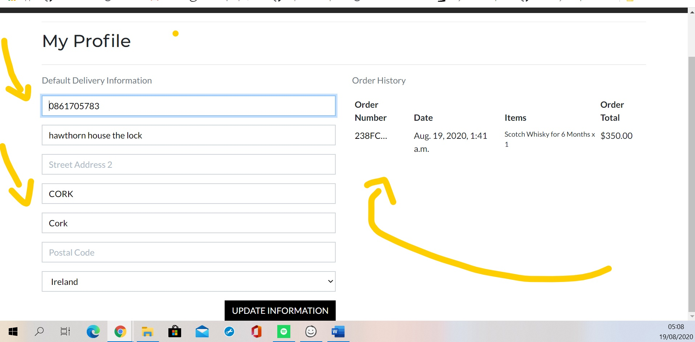</a>

 
Checkout<strong>(Click dropdown for images)</strong>

  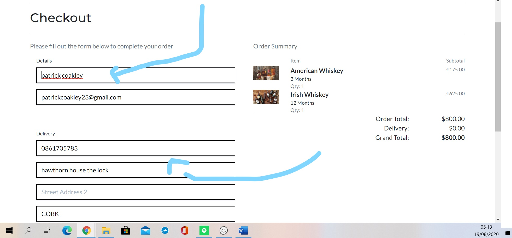</a>

### Authentication
Authentication is a very quick set up thanks to the out of the box app [Django-allauth]( https://django-allauth.readthedocs.io/en/latest/installation.html).
It is an integrated set of Django applications addressing authentication, registration, account management as well as 3rd party (social) account authentication. In simple terms, it is a combination of simple login and registration along with social authentication system.
Django-Allauth is the most popular Django package used for Authentication purposes. 

You can stick to their pre-defined templates or customize them to your liking. For this project i modified the all-auth templates slightly by downloading [Bootstrap's]( https://getbootstrap.com/) crispy forms. Allauth handles all the issues surrounding forgotten passwords, email confirmations etc.

Authentication was a major requirement for my website as users must be registered a logged in, in order to sign up to a subscription. 

### Stripe APi 
I used [Stripe's](www.stripe.com) API to handle the purchases for my ecommerce site. This payment system is only a test system so you'll need to use one of these test cards available [here]( https://stripe.com/docs/testing#cards)

The card numbers you can user for:
    - No authentication (default U.S. card): 4242 4242 4242 4242.
    - Authentication required: 4000 0027 6000 3184.

<h2 align="center">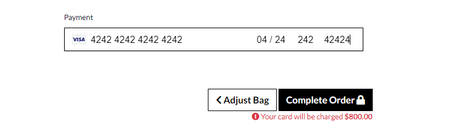</h2>

#### Stripe Webhooks
I implimented webhooks to make my payment system more secure. Stripe uses webhooks to notify your application when an event happens in your account. Webhooks are particularly useful for asynchronous events like when a customer’s bank confirms a payment, a customer disputes a charge, or a recurring payment succeeds.
There a number of scenario's that can go wrong with a online purchase. Users could intentionally or accidentally close the browser window after the payment is confirmed but before the form is submitted to our backend.
Stripe keeps track of what is happening on their side to update Angel's Share if an order has been paid for or not. 

### Future Implimentation
(Due to the tight deadline of 2 weeks to complete this project i was unable to impliment these features)

- **Social Authentication** - some [reports](https://dougbelshaw.com/blog/2018/01/03/identity-on-the-web/#:~:text=We%20know%20that%20social%20sign,the%20traditional%20username%20%2F%20password%20combination.) claim 90% os users prefer social authetication over traditional methods of registration and log in. 
A long with the benefit of increasing the number of signups, social authentication would also give us access to a goldmine which would help with marketing and R&D.

- **Gifts** - I included a section on gift purchases in my wireframes but unfortunately i had to leave them out. Currently users must be logged in, to be able to purchase an order. Having a gift offering where customers could buy one off purchases would be key for the next phase of development. 

- **Stripe Monthly Installments** - Currently users must pay for their subscription upfront. Allowing monthly installments would benefit the UX of Angel's Share. 

## TESTING 
 Test driven development involves designing and developing tests for every small functionality of an application.n simple terms, test cases are created before code is written. The purpose of TDD is to make the code clearer, simple and bug-free.
 Although test driven development was necessary for this project, i did implement so tests Order form and on my Whiskey_club view. 

 ### Testing OrderForm

 1. Test that only fields in the meta class are defined explicitly. 
    - This ensures that if someone changes the model in the future, the form won't display information we don't want it to. 

 2. I then tested to see if required feels are treated as valid when left blank. I submitted a blank field and self.assertFalse(form.is_valid()) so the form wont be valid.

Testing Forms<strong>(Click dropdown for images)</strong>

  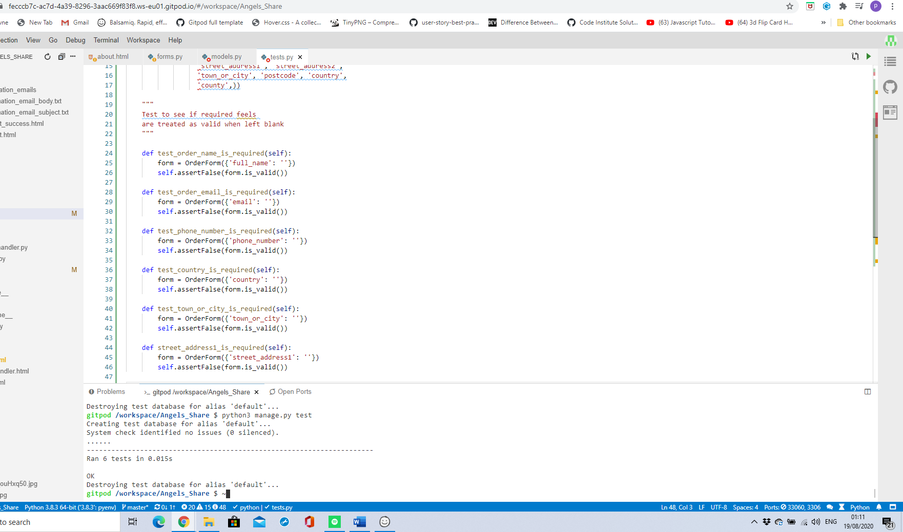</a>

### Testing Views 

1. I then tested my whiskey_clubs view. This basically tests whether the view will return a successful HTTP response, and in our case it did. 

Testing Views<strong>(Click dropdown for images)</strong>

  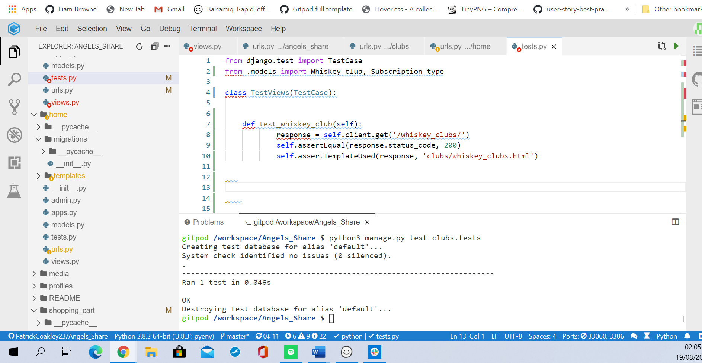</a>

## Credits

### Media 
- The **Angel's Drop** logo was created using [Tailor Brands]( https://www.tailorbrands.com/).
- [Font Awesome]( https://fontawesome.com/start) was the source of all the icons. 
- All of the images were sourced from these [whiskey images]( https://www.shutterstock.com/search/whiskey) from [Shutterstock]( https://www.shutterstock.com/).

### Content 
- Some of the content about Irish Whiskey was inspired or copied directly from this article post titled [An introduction to Irish Whiskey](https://www.primermagazine.com/2013/live/an-introduction-to-irish-whiskey#:~:text=Smooth%20and%20sweet%2C%20the%20nose,over%20heavily%20into%20the%20taste.&text=The%20whiskey%20finishes%20long%2C%20warm%2C%20and%20spicy.) from [Primer Magazine](https://www.primermagazine.com/)
- The content about American Whiskey was inspired or copied directly from this article titled [American Whiskey]( https://www.whisky.com/information/knowledge/production/types-of-whiskies/american-whiskey.html) from [Whisky.com]( https://www.whisky.com/)
- The content about Scottish Whisky was inspired or copied directly from this post titled [The Scotch Whisky Guide]( https://www.gentlemansgazette.com/the-scotch-whisky-guide/) from the [Gentleman's Gazette]( https://www.gentlemansgazette.com/).
