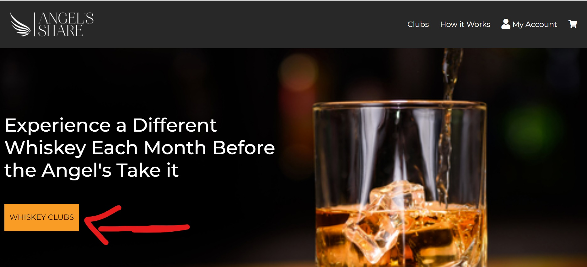

# **The Angel's Share**

As part of my Milestone 4 project with [Code Institute]( https://codeinstitute.net/), I was challenged with using the [Django Framework]( https://www.djangoproject.com/start/overview/) to build a full stack website which is based around business logic used to control a centrally-owned dataset. 

I decided to build a whiskey subscription service called the **Angel's Share**. The name for the brand was chosen after the Angel’s take their cut from every barrel of distilled spirits. In the simplest of terms, the Angel’s Share is the amount of distilled spirits lost to evaporation from the barrel or cask into the air as the whiskey ages.  

The Angel’s Share website, provides three whiskey club subscriptions to choose from: Irish Whiskey, Scottish Whiskey and American Bourbon. Club members can choose between a 3 month, 6 month or a 12 month subscription, with a different bottle of whiskey being delivered each month. 
The various types of whiskey’s selected by the Angel’s Share, range from classic whiskeys everybody is familiar with, to craft specials that are provided exclusively to the Angel’s Share from the distiller. 

The Angel’s Share is perfect for people who have a keen interest in whiskey, or those who want to get started in building a whiskey collection. The Angel’s Share is also a perfect gift option.

## **User Experience (UX)**

-   ### User Stories

    - As a Shopper 

        - As a user I want to be able to view all the product’s/service’s available to purchase from the Angel’s Share. 
            - Choose Your Poison page – users have the option to select between the three whiskey clubs (Irish, Scottish and Bourbon Whiskey)

        - As a User I want to get more information on each whiskey club/product when I click on the relevant club. 
            - Reason for Whiskey selected page with more detailed information like description, rating , taste notes etc. 

        - As a shopper I want to see the different price options for the various clubs. 
            - ‘Choose your hit’ section users can see the price of getting the Angel’s Drop package for 3/6 and 12 month subscriptions. 

        - As a user I want to be able to see an ‘About Page’, so I can understand the type of company the Angel’s Breath is. 
            - Reason for About page.

    - Registration 
        
        - As a user who wants to subscribe to one of the Angel’s Drops whiskey clubs, I would like to be able to register an account easily so I can checkout quicker and receive special offers. 
            - Reason for login/registration. 

        - As a registered user I want to be able to login and logout quickly. 

        - As a one-time user I want to be able to make a once off purchase without signing up. 
            - If purchasing the whiskey subscription as a gift, user’s don’t need to sign up. 

    - Purchasing & Checkout 
        
        - As a user I want to be able to view my shopping bag once I have selected a product, so I can evaluate the details of my purchase and the total cost. 
            - Reason for the shopping bag. 

        - As a user I want to easily enter my payment and shipping information and feel my transaction is safe and secure.
            - Users are brought to the secure checkout and payment is handled by stripe to guarantee a secure transaction. 

    - Admin and Store Management 
        - As a website developer I want to be able to use the basic CRUD functionality to be able to add, edit and delete products/services on the website. 

-   ### **WIREFRAMES**

After reading the project brief i formulated a idea and jotted down notes and rough sketches on pen and paper. These ideas evolved into creating user stories which helped me formulate a plan to draw up some wireframes.
I used [Balsamic](https://balsamiq.com/) to build the wireframes. I created mockups for desktop, tablet and mobile viewports, so i could have an idea of what my website would look like, and i could follow a plan to avoid scope creep.

Desktop Wireframes <strong>(Click dropdown for images)</strong>

  </a>

  </a>

  </a>

  </a>

  </a>

  </a>

  </a>

  </a>

  </a>

Tablet Wireframes <strong>(Click dropdown for images)</strong>

  </a>

  </a>

  </a>

Phone Wireframes <strong>(Click dropdown for images)</strong>

  </a>

  </a>

## **Design**

### Framework
I used Bootstrap 4 to build the framework of the website. Bootstrap was the main tool frame responsible for making the Angel's Share website responsive. This means the website automatically resizes itself to look good on all devices, be it mobile, tablet, laptop or desktop.

### Colour Scheme

- **Black** - Black is the dominant colour throughout this website. Black is elegant, sophisticated and it implies a premium brand. The black background gives prominence to the content on the site. I thought the colour black fitted well within the alcohol and whiskey industry in portraying the Angel's Share as a premium brand. 

- **White** - On some of the pages there is a white background as opposed to the dominant black. The reason being i wanted to go for a clean look that doesn't distract the user from the call to action, be it login/registration or selcting the specific whiskey club or subscription. 

- **Dark Green** - Dark green was used mostly in the headings and borders of this site. I felt it contrasted well to stand out and green is assoicated with the celtic origins whiskey. 

- **Light Orange** - The light orange colour is consistently used across the website's call to action buttons. This shade of orange is similar to the amber colour of whiskey. 

#### List of the other colours used throughout the website: 

- #232323 - (Charcoal) 

- #6c757d (Navy Grey) 

- #aab7c4 (Light Grey)

- #17a268 (turquoise)

### Typography
The “Montserrat” font is the font used for all the headings and the “Lato” font is the font used for the body of the website. Sans serif is set as the fallback font in case for any reason the font isn't being imported into the site correctly.

### Imagery
Imagery is a reoccurring theme throughout the website. I felt images played a vital role in influencing a users decision in the alcohol industry. 
The Hero image especially works well in drawing the user in and given the website a very modern feel.

### Logo 
I created the logo on [Tailor Brands]( https://www.tailorbrands.com/). Although it is a paid service i feel the level of detail and quality of the template they use is worth it. I felt the image is clean, elegant and is positioned well within the whiskey market.  
<h2 align="center"></h2>

## **Layout**

### Homepage

The homepage sets up to be enticing while at the same time obvious to the user the purpose of the website. The heading "Experience a different whiskey each month before the angel's take it", prompts the user to click the 'Whiskey Clubs' button. 

- Call to action: 

    - Whiskey Clubs Button - upon clicking users are brought to the 'Choose Your Poison Page'.

Homepage <strong>(Click dropdown for images)</strong>

  </a>

  

---
### Whiskey Club Selected Page
Once the user clicks the select button on the bottom of the card deck on the Whiskey Clubs page, they are brought to that specific whiskey's details page. This page details a brief description of the whiskey clubs origins and tasting notes. This page also lists what is included in the club package. The cta buttons brings the users to the subscriptions page where they choose the length of their club package. 

## Credits

### Media 
- The **Angel's Drop** logo was created using [Tailor Brands]( https://www.tailorbrands.com/).
- [Font Awesome]( https://fontawesome.com/start) was the source of all the icons. 
- All of the images were sourced from these [whiskey images]( https://www.shutterstock.com/search/whiskey) from [Shutterstock]( https://www.shutterstock.com/).

### Content 
- Some of the content about Irish Whiskey was inspired or copied directly from this article post titled [An introduction to Irish Whiskey](https://www.primermagazine.com/2013/live/an-introduction-to-irish-whiskey#:~:text=Smooth%20and%20sweet%2C%20the%20nose,over%20heavily%20into%20the%20taste.&text=The%20whiskey%20finishes%20long%2C%20warm%2C%20and%20spicy.) from [Primer Magazine](https://www.primermagazine.com/)
- The content about American Whiskey was inspired or copied directly from this article titled [American Whiskey]( https://www.whisky.com/information/knowledge/production/types-of-whiskies/american-whiskey.html) from [Whisky.com]( https://www.whisky.com/)
- The content about Scottish Whisky was inspired or copied directly from this post titled [The Scotch Whisky Guide]( https://www.gentlemansgazette.com/the-scotch-whisky-guide/) from the [Gentleman's Gazette]( https://www.gentlemansgazette.com/).
