# **The Angel's Share**

[View Live Project here](https://angels-share.herokuapp.com/)

As part of my Milestone 4 project with [Code Institute]( https://codeinstitute.net/), I was challenged with using the [Django Framework]( https://www.djangoproject.com/start/overview/) to build a full stack website which is based around business logic used to control a centrally-owned dataset. 

I decided to build a whiskey subscription service called the **Angel's Share**. The name for the brand was chosen after the Angel’s take their cut from every barrel of distilled spirits. In the simplest of terms, the Angel’s Share is the amount of distilled spirits lost to evaporation from the barrel or cask into the air as the whiskey ages.  

The Angel’s Share website, provides three whiskey club subscriptions to choose from: Irish Whiskey, Scottish Whisky and American Whiskey. Club members can choose between a 3 month, 6 month or a 12 month subscription, with a different bottle of whiskey being delivered each month. 
The various types of whiskey’s selected by the Angel’s Share, range from classic whiskeys everybody is familiar with, to craft specials that are provided exclusively to the Angel’s Share from the distiller. 

The Angel’s Share is perfect for people who have a keen interest in whiskey, or those who want to get started in building a whiskey collection. 

## **User Experience (UX)**

-   ### User Stories

    - As a Shopper 

        - As a user I want to be able to view all the product’s/service’s available to purchase from the Angel’s Share website. 
            - Choose Your Poison page – users have the option to select between the three whiskey clubs (Irish, Scottish and Bourbon Whiskey)

        - As a User I want to get more information on each whiskey club/product when I click on the relevant club. 
            - Reason for Whiskey selected page with more detailed information like description, rating , taste notes etc. 

        - As a shopper I want to see the different price options for the various clubs. 
            - ‘Choose your hit’ section users can see the price of getting the Angel’s Drop package for 3/6 and 12 month subscriptions. 

        - As a user I want to be able to see an ‘About Page’, so I can understand the how the service and membership works. 
            - Reason for 'How it Works Page'

    - Registration 
        
        - As a user who wants to subscribe to one of the Angel’s Share whiskey clubs, I would like to be able to register an account easily so I can checkout quicker and receive special offers. 
            - Reason for login/registration. 

        - As a registered user I want to be able to login and logout quickly. 

    - Purchasing & Checkout 
        
        - As a user I want to be able to view my shopping bag once I have selected a subscription, so I can evaluate the details of my purchase and the total cost. 
            - Reason for the shopping bag. 

        - As a user I want to easily enter my payment and shipping information and feel my transaction is safe and secure.
            - Users are brought to the secure checkout and payment is handled by stripe to guarantee a secure transaction. 

    - Admin and Store Management 
        - As a website developer I want to be able to use the basic CRUD functionality to be able to add, edit and delete products/services on the website. 

-   ### **WIREFRAMES**

After reading the project brief I formulated a idea and jotted down notes and rough sketches on pen and paper. These ideas evolved into creating user stories which helped me formulate a plan to draw up some wireframes.
I used [Balsamiq](https://balsamiq.com/) to build the wireframe's. I created mockups for desktop, tablet and mobile view ports, so I could have an idea of what my website would look like, and I could follow a plan to avoid scope creep.

Desktop Wireframes <strong>(Click dropdown for images)</strong>

  </a>

  </a>

  </a>

  </a>

  </a>

  </a>

  </a>

  </a>

  </a>

Tablet Wireframes <strong>(Click dropdown for images)</strong>

  </a>

  </a>

  </a>

Phone Wireframes <strong>(Click dropdown for images)</strong>

  </a>

  </a>

## **Design**

### Framework
I used Bootstrap 4 to build the framework of the website. Bootstrap was the main tool frame responsible for making the Angel's Share website responsive. This means the website automatically resizes itself to look good on all devices, be it mobile, tablet, laptop or desktop.

### Colour Scheme

- **Black** - Black is the dominant colour throughout this website. Black is elegant, sophisticated and it implies a premium brand. The black background gives prominence to the content on the site. I thought the colour black fitted well within the alcohol and whiskey industry in portraying the Angel's Share as a premium brand. 

- **White** - On some of the pages there is a white background as opposed to the dominant black. The reason being, I wanted to go for a clean look that doesn't distract the user from the call to action, be it login/registration, shopping cart details or entering card and shipping details.

- **Light Orange** - The light orange colour is consistently used across the website's call to action buttons. This shade of orange is similar to the amber colour of whiskey. This colour is used on most of the whiskey pages call to action buttons as it pairs well with the black background.

There are other colours used on the site but they are used for minor style touches. 

### Typography
The “Montserrat” font is the font used for all the headings and the “Lato” font is the font used for the body of the website. Sans serif is set as the fallback font in case for any reason the font isn't being imported into the site correctly.

### Imagery
Imagery is a reoccurring theme throughout the website. I felt images played a vital role in influencing a users decision in the alcohol industry. 
The Hero image especially works well in drawing the user in, and given the website a very modern feel.

### Logo 
I created the logo on [Tailor Brands]( https://www.tailorbrands.com/). Although it is a paid service I feel the level of detail and quality of the template they use is worth it. I felt the image is clean, elegant and is positioned well within the whiskey market.  
<h2 align="center"></h2>

## **Layout**

### Homepage

The homepage sets up to be enticing while at the same time obvious to the user the purpose of the website. The heading "Experience a different whiskey each month before the angel's take it", prompts the user to click the 'Whiskey Clubs' button. 

- Call to action: 

    - Whiskey Clubs Button - upon clicking users are brought to the 'Choose Your Poison Page'.

Homepage <strong>(Click dropdown for images)</strong>

  </a>

  

---
### Whiskey Club Selected Page / Choose Your Poison
Once the user clicks the select button on the bottom of the card deck on the Whiskey Clubs page, 
they are brought to that specific whiskey's details page. 
This page is the first step in the process in signing up to an 'Angel's Share' Whiskey Club. 
The images were specifically chosen as they showcase some of the most famous whiskey brands from each club.

Choose Your Poison Page <strong>(Click dropdown for images)</strong>

  </a>

  

---
### Whiskey Selected Page
This page is a very descriptive page on the whiskey selected by the user. This page explains the history, origins and distilling methods associated with that specific whiskey club. 

Whiskey Selected <strong>(Click dropdown for images)</strong>

  </a>

  

Tasting notes are also included to allow users evaluate in their own mind which whiskey would best suit them based on their preferences or biases. 

Tasting Notes <strong>(Click dropdown for images)</strong>

  </a>

  

The first two sections just mentioned differ based on the whiskey selected. This whiskey package section however is the exact same for all three whiskey clubs. 
This section just briefly explains the added extras aside from the bottle of whiskey the **Angel's Share** members receive each month;

- Flavour profiles and tasting notes for each bottle.
- Tutorial on how to recognise different whiskey blends.
- Whiskey Production Techniques
- Expert evaluations and commentary on bottles.

Whiskey Package <strong>(Click dropdown for images)</strong>

  </a>

  

---
### Choose Your Hit
This page has a similar layout to the 'Choose Your Poison' Page. This is the final step in the choosing the whiskey club you want to sign up to before it's added to the cart.

Choose Your Hit <strong>(Click dropdown for images)</strong>

  </a>

  

---
### How It Works 
Users may be skeptical or curious as to what the Angel's Share is or what it entails. The 'How it Works' page is there to strengthen the message of what the Angel's Share is all about.
This page uses icons and images to get the message across in a clear manner. The combination of images and icons also turns a regular mundane about page into an eye catching page.

How it Works <strong>(Click dropdown for images)</strong>

  </a>

  

---
### Shopping Cart / Profile / Order page / Checkout page / Authentication pages
for the Shopping Cart / Profile / Order page / Checkout page / Authentication pages I decided to keep a clean tidy design. 
The background for all these pages is white and is paired with black font, borders and buttons. 

I felt if I carried on with the same colour theme as I did for the whiskey pages, it may not be as easy to read as the clean white background. 

These pages involve the user either inputting or receiving information which is key to the order transactions, 
so I tried to keep the medium of passing information as neat as possible with no clutter. 

White and black design for information pages <strong>(Click dropdown for images)</strong>

  </a>

  </a>

  </a>

  </a>

  </a>

 

---
### 404 Page
I created a customized error page incase a user gets a 404 message.

404 Page <strong>(Click dropdown for images)</strong>

  </a>

  

---
### Base Template 
The base.html contains the basic layout which is common to all the other templates, and it is from this base template that we extend the layout for other pages.
We modify the parent template(base.html) using the child templates (e.g the pages listed above). The  must be the first tag in the child templates. This tag tells the template engine that this template extends from the parent template or ( base.html ).

We then use Template inheritance eg. 

    
    {& endblock %}

To override the base.html page and add our custom code to the child elements. 

The Base.Html page in this website contains all the relevant links to our bootstrap framework, font awesome, css files, Jquery and other relevant meta tags. The Base.html also sets the template for the navbar and flash messages used throughout the website and the reoccurring css styles like font, colour, background colour etc. 

The navbar is the same across all sites so we only needed to create it once in the base template, and that meant it was made available across the site. 

---
## TECHNOLOGIES

### Languages Used 

1. [HTML5]( https://en.wikipedia.org/wiki/HTML5) - is the standard markup language for documents designed to be displayed in a web browser.
2. [CSS3]( https://en.wikipedia.org/wiki/Cascading_Style_Sheets) - Cascading Style Sheets is a style sheet language used for describing the presentation of a document written in a markup language like HTML.
3. [Python]( https://www.python.org/) - Python is an interpreted, high-level, general-purpose programming language.
4. [Javascript/Jquery]( https://en.wikipedia.org/wiki/JavaScript) - JavaScript is among the most powerful and flexible programming languages of the web. It powers the dynamic behavior on most websites.

 ### Frameworks, Libraries & Programs Used 

1. [Bootstrap 4.4.1:]( https://getbootstrap.com/docs/4.4/getting-started/introduction/)
    - Bootstrap was used to assist with the responsiveness and styling of the website.</li>

2. [Django]( https://www.djangoproject.com/) - Django is a Python-based free and open-source web framework that follows the model-view-controller architectural pattern.
    - Django helped reduced the web application development time. Django allowed me to build custom web applications and also reuse applications I used previously.

3. [SQLite]( https://www.sqlite.org/index.html)
    - SQLite was the database I used in development. By default, Django automatically creates a SQLite database for your project. SQLite is a relational database management system

4. [Google Fonts:]( https://fonts.google.com/)
    - Google fonts were used to import the 'Oswald' font and the 'Open Sans' font into the style.css file which is used on all pages throughout the website.

5. [Font Awesome:]( https://fontawesome.com/)
    - Font Awesome was used on throughout the website to add icons for aesthetic and UX purposes.

6.  [Git]( https://git-scm.com/)
    - Git was used for version control by utilizing the Gitpod terminal to commit to Git and Push to GitHub.

7. [GitHub:]( https://github.com/)
    - GitHub is used to store the projects code after being pushed from Git.

8. [Balsamiq:]( https://balsamiq.com/)
    - Balsamiq was used to create the wireframes during the design process.

9. [PEP8]( http://pep8online.com/)
    - Python style guide checker. PEP8 is a tool to check your Python code against some of the style conventions in PEP 8.

10. [Heroku]( www.heroku.com)
    - Heroku is a cloud platform which was used to host my website.

11. [The W3C Markup Validator]( https://validator.w3.org/) and [W3C CSS Validator Services]( https://jigsaw.w3.org/css-validator/) 
    - Used to validate the HTML and CSS of the project to ensure there were no syntax errors in the project.

12. [PostgreSQL](https://www.postgresql.org/) - PostgreSQL, also known as Postgres, is a free and open-source relational database management system. 
    - Postgres was the databased that was used when my site was hosted on Heroku.

13. [Stripe](https://stripe.com/ie?utm_campaign=paid_brand-IE_en_Search_Brand_Stripe-1615558792&utm_medium=cpc&utm_source=google&ad_content=307359047688&utm_term=stripe&utm_matchtype=e&utm_adposition=&utm_device=c&gclid=Cj0KCQjwvvj5BRDkARIsAGD9vlJGQ9ppJLi4-XT1JXNiZubmSEW391kWMZ-nFpVjnAoj5YOItL7_amEaAm0EEALw_wcB)
    - as payment platform to validate and accept credit card payments securely.

14. [AWS S3 BUCKET](https://aws.amazon.com/s3/) - to store images and static files entered into the database.

## FEATURES

### CRUD Functionality
Create Read Update and Delete(CRUD)

- **Create** Logged in Users can create an order for a club by choosing their whiskey club and subscription plan. 

Create<strong>(Click dropdown for images)</strong>

  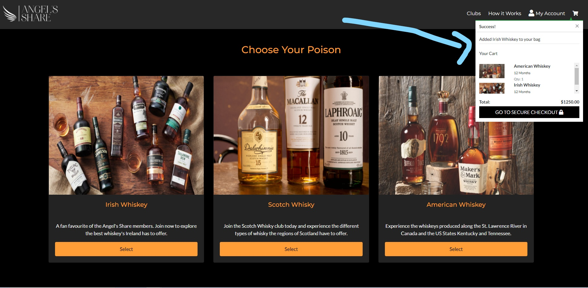</a>

- **Read** users can see what they have ordered in the cart, and can see their order history in their profile page. 

Read<strong>(Click dropdown for images)</strong>

  </a>
  </a>

- **Update** After adding subscription plans to their shopping cart, whilst in the shopping cart, users can update the subscription plan they are about to purchase by selecting the dropdown and pressing the update button. 

 
Update<strong>(Click dropdown for images)</strong>

  </a>

- **Delete** Similarly to the update function, whilst in the shopping cart, users can delete orders from their cart. 

Delete<strong>(Click dropdown for images)</strong>

  </a>

### Forms
There are two forms on this website which are interlinked and allow users to create and edit models in the backend. Users can create a profile form and save the information which will pre populate the order information the next time they make an order. And on the reverse side, when a user is making an order, they can save the order information to update the profile model. 
Users previous orders are also stored in their profile, so they can keep track of their subscriptions. 

Profile<strong>(Click dropdown for images)</strong>

  </a>

 
Checkout<strong>(Click dropdown for images)</strong>

  </a>

### Authentication
Authentication is a very quick set up thanks to the out of the box app [Django-allauth]( https://django-allauth.readthedocs.io/en/latest/installation.html).
It is an integrated set of Django applications addressing authentication, registration, account management as well as 3rd party (social) account authentication. In simple terms, it is a combination of simple login and registration along with social authentication system.
Django-Allauth is the most popular Django package used for Authentication purposes. 

You can stick to their pre-defined templates or customize them to your liking. For this project I modified the all-auth templates slightly by downloading [Bootstrap's]( https://getbootstrap.com/) crispy forms. Allauth handles all the issues surrounding forgotten passwords, email confirmations etc.

Authentication was a major requirement for my website as users must be registered and logged in, in order to sign up to a subscription. 

### Stripe APi 
I used [Stripe's](www.stripe.com) API to handle the purchases for my ecommerce site. This payment system is only a test system so you'll need to use one of these test cards available [here]( https://stripe.com/docs/testing#cards)

The card numbers you can user for:
    - No authentication (default U.S. card): 4242 4242 4242 4242.
    - Authentication required: 4000 0027 6000 3184.

<h2 align="center"></h2>

#### Stripe Webhooks
I implemented webhooks to make my payment system more secure. Stripe uses webhooks to notify your application when an event happens in your account. Webhooks are particularly useful for asynchronous events like when a customer’s bank confirms a payment, a customer disputes a charge, or a recurring payment succeeds.
There a number of scenario's that can go wrong with a online purchase. Users could intentionally or accidentally close the browser window after the payment is confirmed but before the form is submitted to our backend.
Stripe keeps track of what is happening on their side to update Angel's Share if an order has been paid for or not. 

### Future Implimentation
(Due to the tight deadline of 2 weeks to complete this project I was unable to impliment these features)

- **Social Authentication** - some [reports](https://dougbelshaw.com/blog/2018/01/03/identity-on-the-web/#:~:text=We%20know%20that%20social%20sign,the%20traditional%20username%20%2F%20password%20combination.) claim 90% os users prefer social authetication over traditional methods of registration and log in. 
A long with the benefit of increasing the number of signups, social authentication would also give us access to a goldmine which would help with marketing and R&D.

- **Gifts** - I included a section on gift purchases in my wireframes but unfortunately I had to leave them out. Currently users must be logged in, to be able to purchase an order. Having a gift offering where customers could buy one off purchases would be key for the next phase of development. 

- **Stripe Monthly Installments** - Currently users must pay for their subscription upfront. Allowing monthly installments would benefit the UX of Angel's Share. 

- **Blog Posts** - allowed signed up members to have their own social community and share their experiences of the whiskey they have tried. 

## TESTING 
 Test driven development involves designing and developing tests for every small functionality of an application.n simple terms, test cases are created before code is written. The purpose of TDD is to make the code clearer, simple and bug-free.
 Although test driven development wasn't necessary for this project, I did implement so tests Order form and on my Whiskey_club view. 

### Testing OrderForm

 1. Test that only fields in the meta class are defined explicitly. 
    - This ensures that if someone changes the model in the future, the form won't display information we don't want it to. 

 2. I then tested to see if required feels are treated as valid when left blank. I submitted a blank field and self.assertFalse(form.is_valid()) so the form wont be valid.

Testing Forms<strong>(Click dropdown for images)</strong>

  </a>

### Testing Views 

1. I then tested my whiskey_clubs view. This basically tests whether the view will return a successful HTTP response, and in our case it did. 

Testing Views<strong>(Click dropdown for images)</strong>

  </a>

## Manual Testing 
Manual testing was the main form of testing I did to access the functionality, usability and responsiveness and data management of my full stack web application. Debugging was carried out on an ongoing basis throughout the development of the project. Whilst coding I would run my code in the browser and check for any bug issues and make changes and fixes on an ad hoc basis. Some of the debugging I carred out, is mentioned in the responsiveness sub section below.

I carried out manual testing and documented any errors/random side-effects captured in the Chrome Developer Tools. I loaded the website several times, and forced browser refresh to try and catch any errors but thankfully there was none.

Dev Tool Testing<strong>(Click dropdown for images)</strong>

  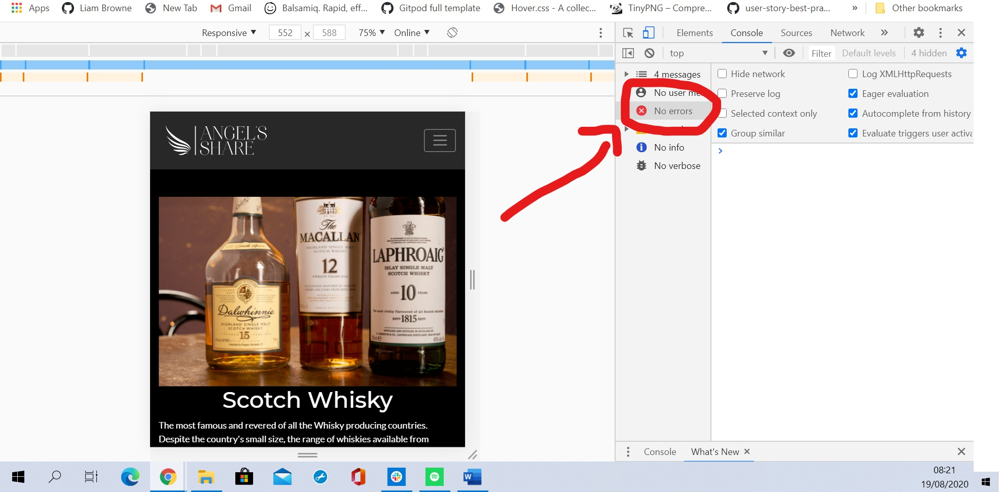</a>

### Validators

#### HTML Validators
I tested the code on [W3C HTML VALIDATOR]( https://validator.w3.org/).
If I directly inputted my code into the validator I would only get errors related to the base templates so these can be ignored.

If I inputted the url into the validator I only got a warning related to he type attribute is unnecessary for JavaScript resources ( )
This can also be ignored as it doesn't affect the code. 

    
HTML Validator <strong>(Click dropdown for images)</strong>

    

    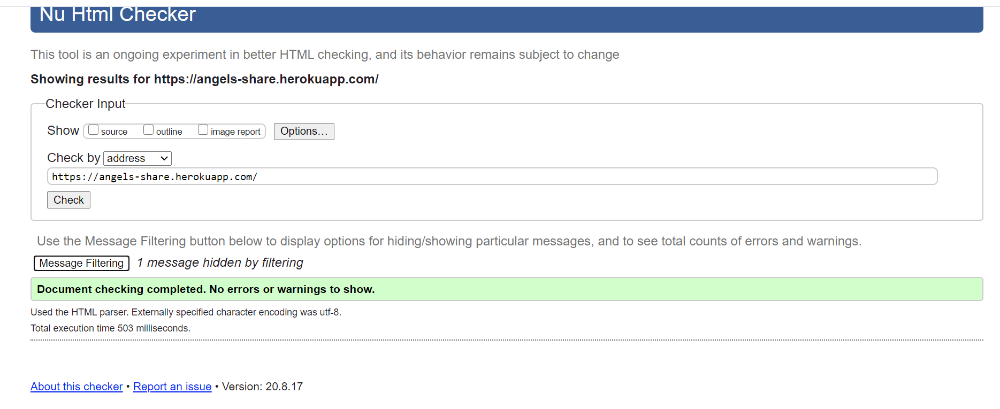</a>
    
 

#### Pep8
I carried out [PEP8 testing]( http://pep8online.com/) to improve the readability and consistency of my Python code. Pep8 is installed on my [Gitpod](https://gitpod.io/) workspace, so I check it regularly for errors or warnings. They are usually only minor issue like; like a line being too long or having a trailing whitespace on a line. Sometimes I would use [PEP8 Online Testing]( http://pep8online.com/) as I find it easier to spot the errors on that site. Below is my pass result for pep8 

There was one error in the Checkout models, with a line being too long. 

def __str__(self):
        return f'{self.whiskey_club.name} for {self.subscription_type.name} on order {self.order.order_number}'

In my opinion breaking up this line would actually make it read worse so i left it. 

Pep8 errors<strong>(Click dropdown for images)</strong>

  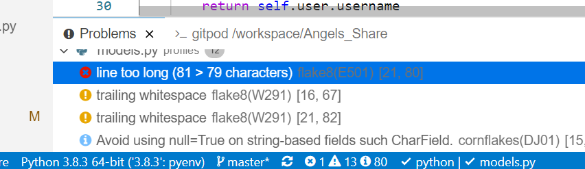</a>

Pep8 Pass<strong>(Click dropdown for images)</strong>

  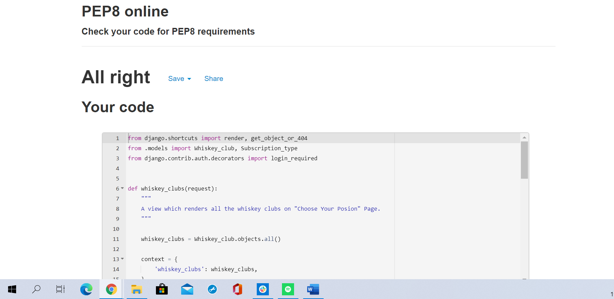</a>

#### CSS Validators

I tested the css code on W3C CSS Validator and passed. 

CSS Validator<strong>(Click dropdown for images)</strong>

  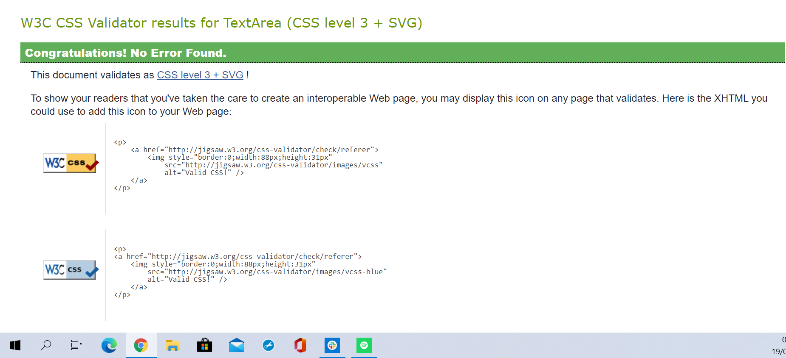</a>

### Responsiveness
I carried out extensive testing of the responsiveness of my website, by checking how the website rendered on different devices and on lower screen widths.
I have showcased screngrabs of how the website pages rendered on desktop/laptop view, tablet and mobile view. 

Testing in [Chrome Developer Tools]( https://developers.google.com/web/tools/chrome-devtools) was carried out on an ongoing basis to check the responsiveness and carried out debugging of issues.

#### Homepage (Hero Image)
I didn't have to change anything on the homepage to make it responsive, as it rendered well on Laptop/desktop tablet and mobile. Generally I implement a media query for smaller screen widths to centre the hero image. 
The mobile display looks slightly different than the tablet and desktop view as the whiskey bottle is out of view, however I thought the mobile view, looked equally as good and appropriate for my website with only the whiskey glass on the hero image.

Homepage Responsiveness<strong>(Click dropdown for images)</strong>

  </a>

  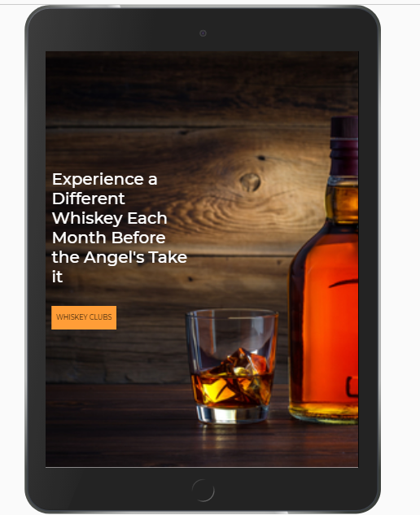</a>

  </a>

#### Choose Your Poison and Choose Your Hit 
The Choose Your Poison and Choose Your Hit pages have the same card deck layout. during development I had a bug issue where the items were't aligning in the card deck. 
This is the sort of debugging that was carried out on an ad hoc basis. I would run the project, see it in the browser and make the necessary changes.
Here I had to add display flex and other changes to the card body. 

Debug<strong>(Click dropdown for images)</strong>

  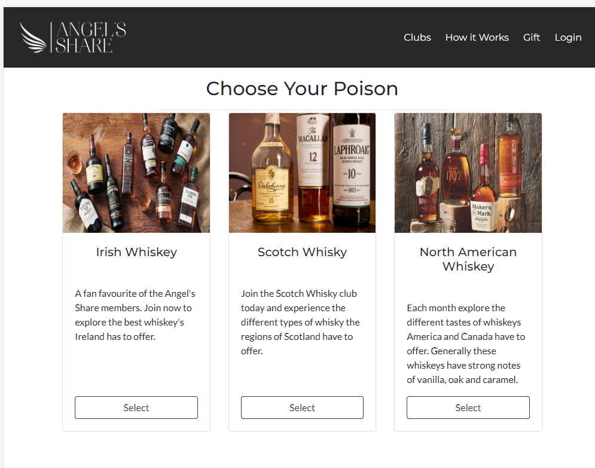</a>

The only responsive changes I had to make for these two pages was a media query for max-width of 768px because up to that width the card decks took up an entire column and there needed to be a margin between the card decks otherwise they would be stacked on top of each other.
Also at on any width above 768px I made the images within the card deck 20vw (viewport width) so they appeared larger on larger devices. 

Choose Your Poison <strong>(Click dropdown for images)</strong>

  </a>

  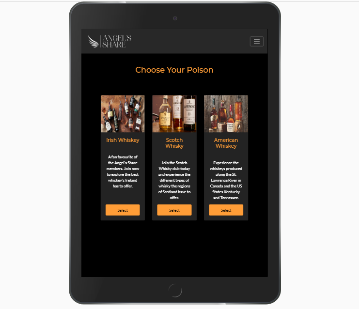</a>

  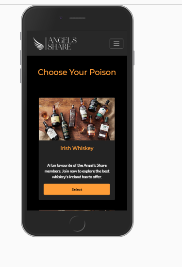</a>

Choose Your Hit <strong>(Click dropdown for images)</strong>

  </a>

  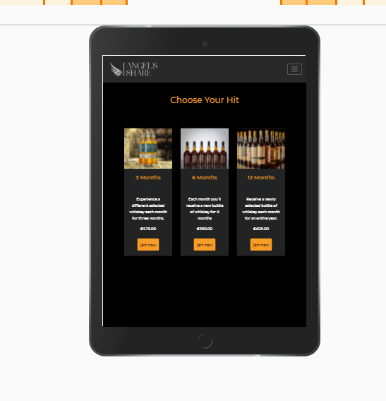</a>

  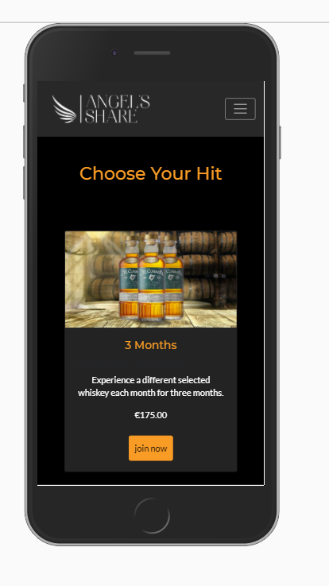</a>

### Whiskey Selected Page
This page was required the most styling in order for it to be responsive across all screen widths as it was a heavily customized page. 
As you can see all the content is stacked above each other on lower screen widths.On medium screen widths and above the content and images are place next to each other. 

I have also shown an example of the bug I fixed for the bottom container also. in the first image, the original bug, it is hard to read the content with the whiskey glass in the background.
To overcome this I implemented a media query and reduced the height of the image and reduced the top margin on the content. 

Debug & Fix <strong>(Click dropdown for images)</strong>

  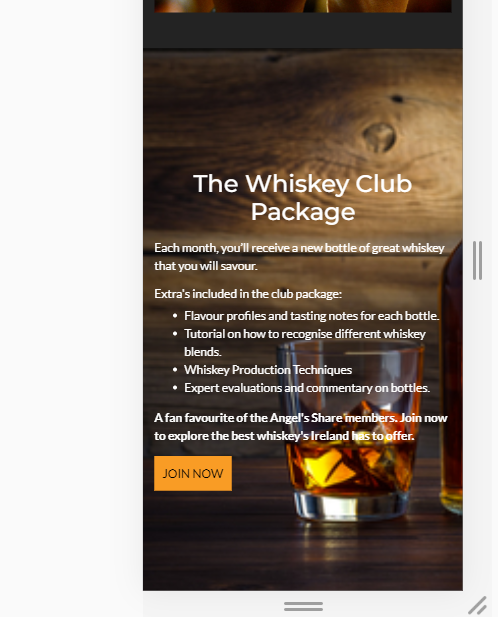</a>

  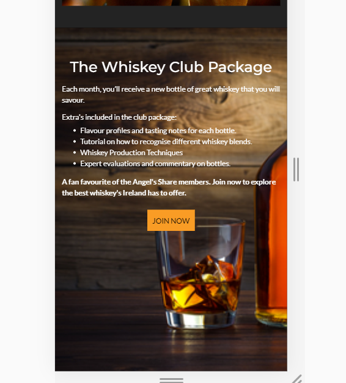</a>

Whiskey Selected Desktop <strong>(Click dropdown for images)</strong>

  </a>

  </a>

  </a>

Whiskey Selected Ipad <strong>(Click dropdown for images)</strong>

  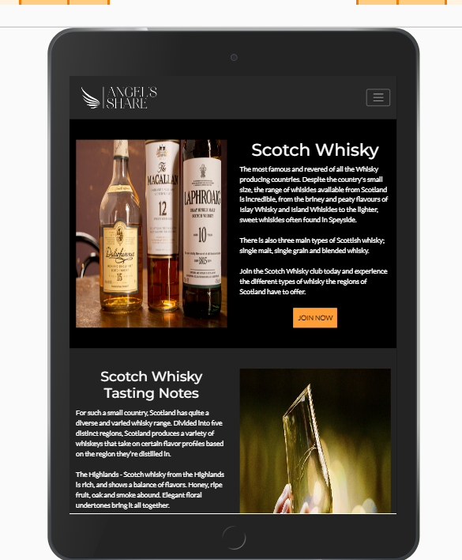</a>

  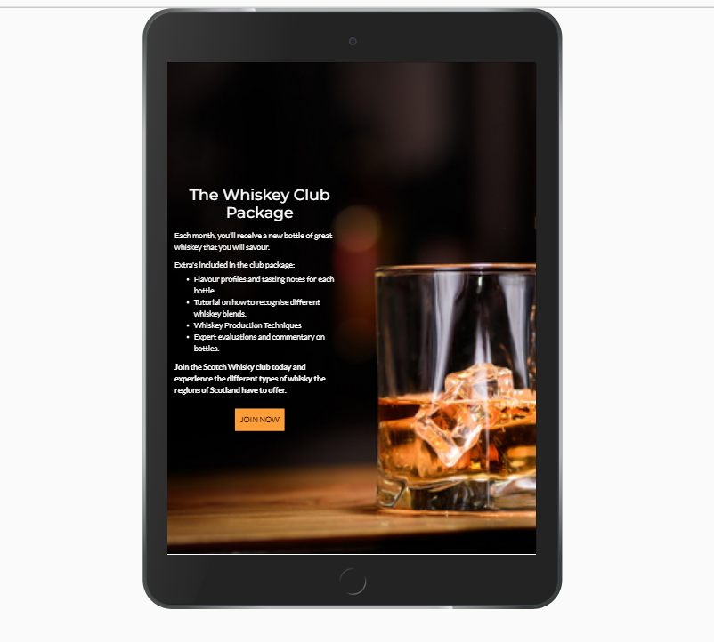</a>

Whiskey Selected Mobile <strong>(Click dropdown for images)</strong>

  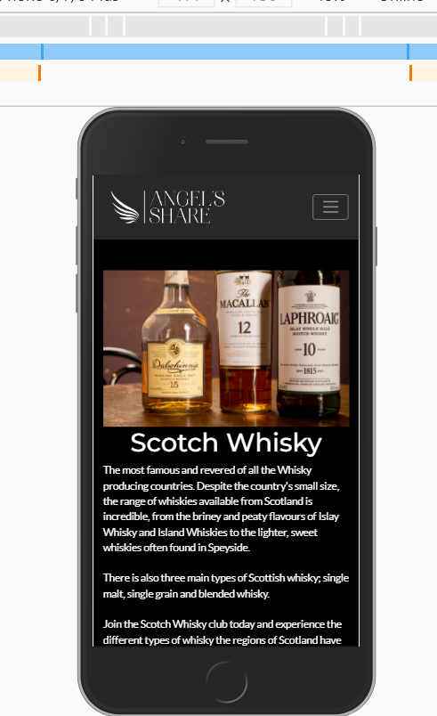</a>

  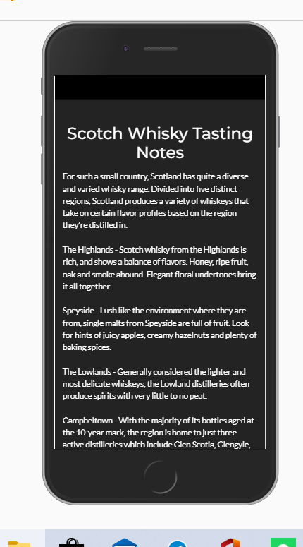</a>

  </a>

### How It Works Page 
On smaller screen widths each step is stacked on top of each other. On medium screen widths each step takes up a third of the page

How it Works Responsiveness <strong>(Click dropdown for images)</strong>

  </a>

  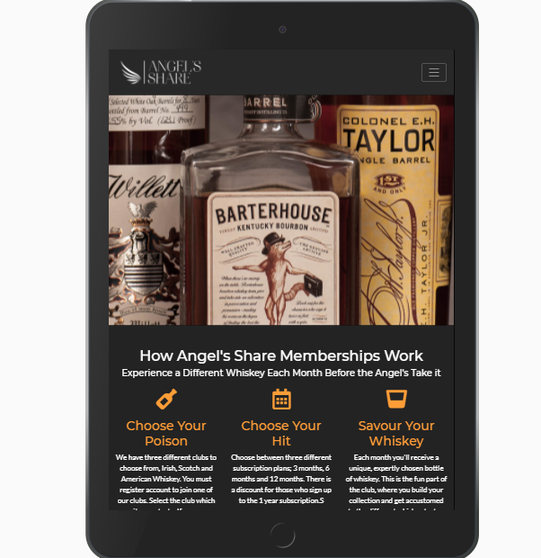</a>

  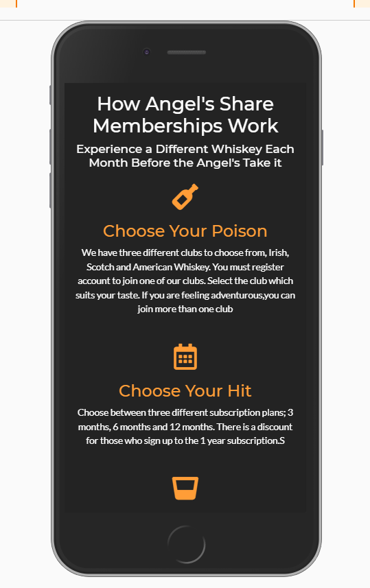</a>

### 404 error
This page stacks on top of each other on smaller screen widths. 

How it Works Responsiveness <strong>(Click dropdown for images)</strong>

  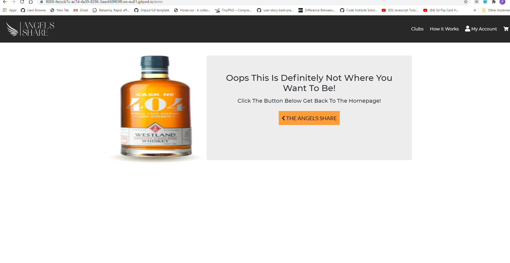</a>

  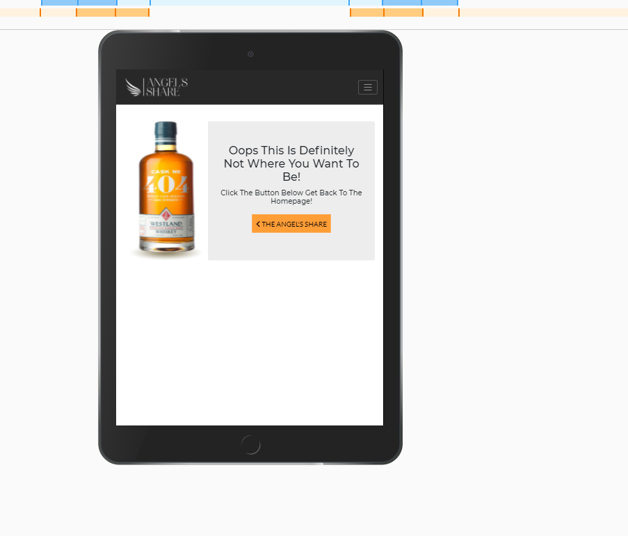</a>

  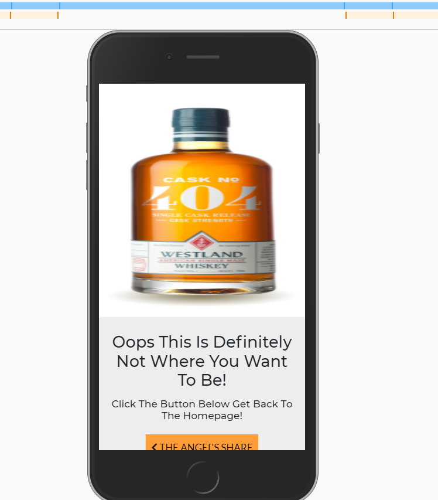</a>

### Shopping Cart / Profile / Order page / Checkout page / Authentication pages
Since these pages are very much template boostrap forms and involve not much customization, I decided to upload a video showcasing the responsiveness of these pages instead of uploading several screengrab's.

<a href="https://www.youtube.com/watch?v=7GutIKUibR8&feature=youtu.be">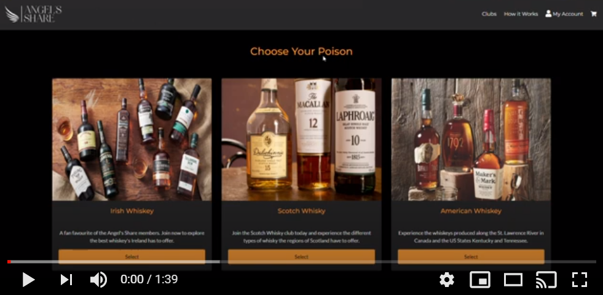</a>

**Click the image or the link here [Youtube Video](https://www.youtube.com/watch?v=7GutIKUibR8&feature=youtu.be)**

## Testing on different browsers and devices
**The main points from this type of testing**
    
  - The Website was tested on Google Chrome,Internet Explorer, Microsoft Edge, Mozilla Firefox and Safari browsers.

  - The website was viewed on a variety of devices such as Desktop, Large Monitor, Laptop, iPhone7, iPhone 8 & iPhoneX and other samsung devices.

  - A large amount of testing was done to ensure that all pages were linking correctly.

  - Friends and family members were asked to review the site and point out any bugs and/or user experience issues.

  - Yet again, Internet Explorer performed poorly. Buttons are either positioned incorrectly or don’t appear at all. Horizontal rules are also out of position on Internet Explorer.         

## Testing of User Stories 

### As a Shopper

1.  As a user I want to be able to view all the product’s/service’s available to purchase from the Angel’s Share website. 
    * Once the user lands on the hompage they are greeted by the call to action button 'Whiskey Clubs' which brings them to the choose your poison page. 
    Users see all the whiskey clubs available to subscribe to immediately. 

User story 1 <strong>(Click dropdown for images)</strong>

  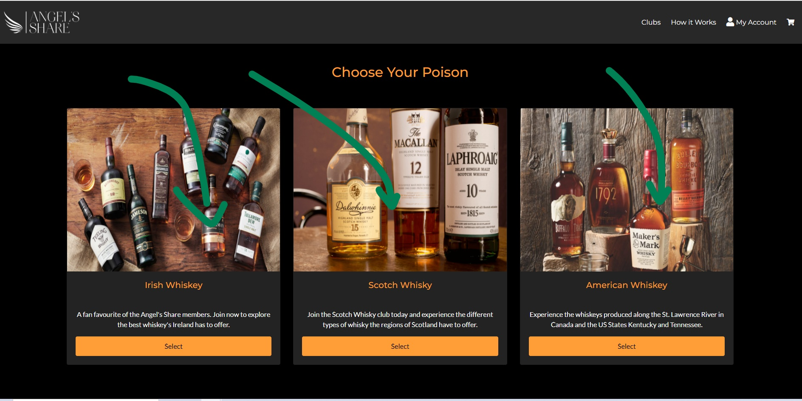</a>

---

2. As a User I want to get more information on each whiskey club/product when I click on the relevant club.
    * On the 'Choose Your Poison' page, once the user selects the specific whiskey they are interested in, they are brought to the whiskey details page which gives a description on the origins of that specific type of whiskey, distilling methods, taste notes and a brief history. 

User Story 2 <strong>(Click dropdown for images)</strong>

  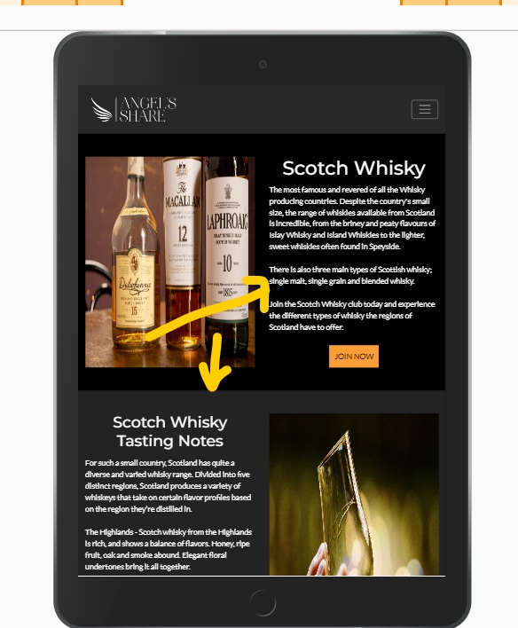</a>

---

3. As a shopper I want to see the different price options for the various clubs.
    * 'Choose your hit' section users can see the price of getting the Angel’s Drop package for 3/6 and 12 month subscriptions.

User Story 3 <strong>(Click dropdown for images)</strong>

  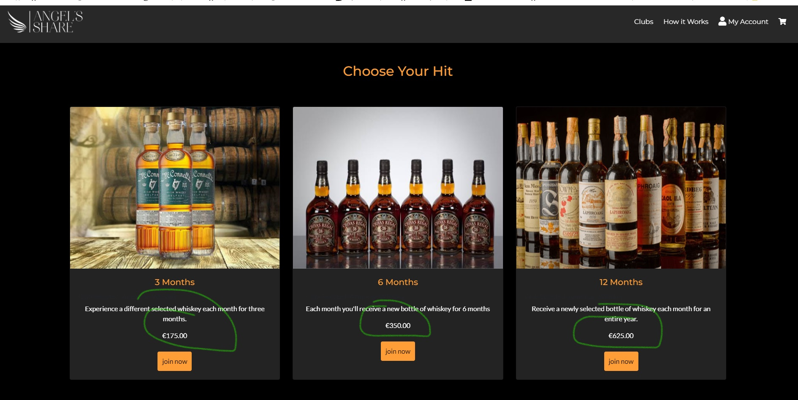</a>

---

4. As a user I want to be able to see some sort of 'About page' as I never heard of a whiskey subscription club before. 
    * 'How It Works' - this page's main purpose is to reaffirm the service Angel's Share is providing and what a simple process it is. 
    This page uses icons and images to inform the user of the service in a fun imaginative way.

User Story 4 <strong>(Click dropdown for images)</strong>

  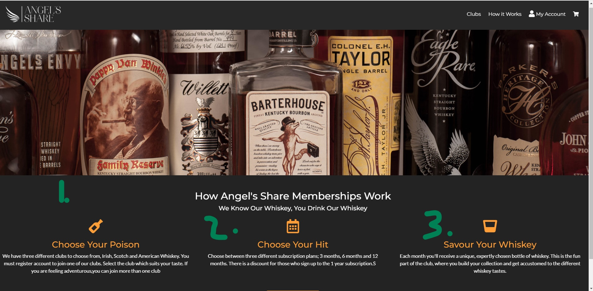</a>

---

### As a Registerd User 

5. As a user who wants to subscribe to one of the Angel’s Drops whiskey clubs, I would like to be able to register an account easily so I can checkout quicker and receive special offers.

User Story 5 <strong>(Click dropdown for images)</strong>

  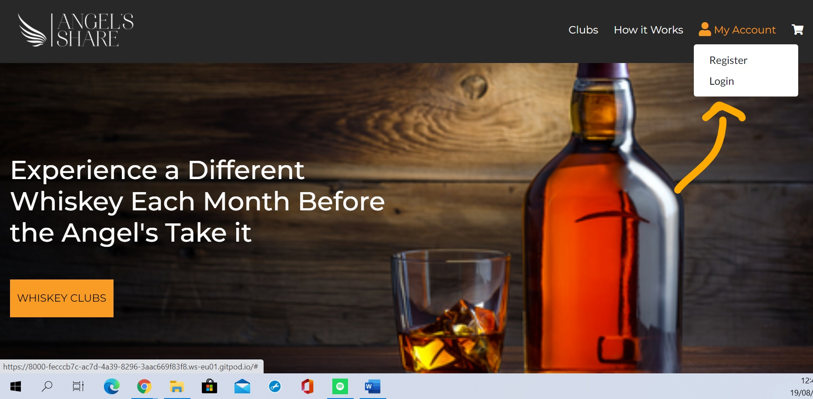</a>

6. As a registered user I want to be able to login and logout quickly.

User Story 6 <strong>(Click dropdown for images)</strong>

  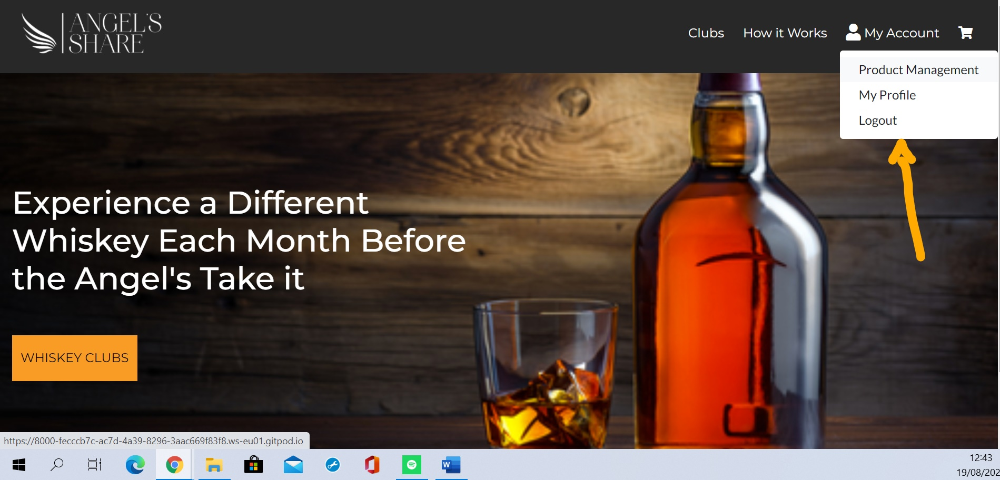</a>

Django-Allauth is the framework which handles the authorization for the Angel's Share website. The 'My Account' navbar item is available on every page on the website. The 'My Account' dropdown includes an if statement, which checks if the user is authenticated or not. If the user is logged in they will see whats in the image for user story 6. 
If they are not logged in they will see the dropdown items; login and registration.

---

### Purchasing and Checkout

7. As a user I want to be able to view my shopping bag once I have selected a product, so I can evaluate the details of my purchase and the total cost.
    * thanks to the contexts.py page, the items that are added to the cart, are made available across the entire website. Once the user clicks the shopping cart icon, their cart details will appear in the shopping cart. 
    * When the user adds an item to the cart, they are prompted with a toast notification showing the details of their cart. 

User Story 7 <strong>(Click dropdown for images)</strong>

  </a>

  </a>

---

8. As a user I want to easily enter my payment and shipping information and feel my transaction is safe and secure.
    * Stripe handles all the payments, so users can feel safe and secure that their cards are being handled by a respected and secure payment provider. 

User Story 8 <strong>(Click dropdown for images)</strong>

  </a>

---

### Admin and Store Management

9. As a website developer I want to be able to use the basic CRUD functionality to be able to add, edit and delete products/services on the website.

I can Create Subscriptions / Whiskey Clubs 

User Story 9 **Create** <strong>(Click dropdown for images)</strong>

  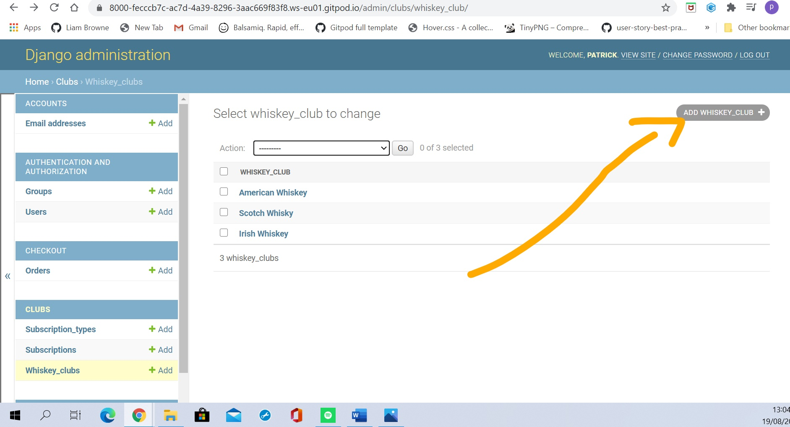</a>

I can read orders, see subscriptions, the whiskey club, userprofile, total etc

User Story 9 **Read** <strong>(Click dropdown for images)</strong>

  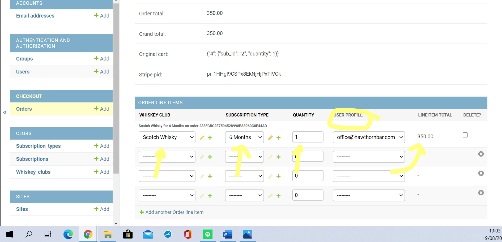</a>

  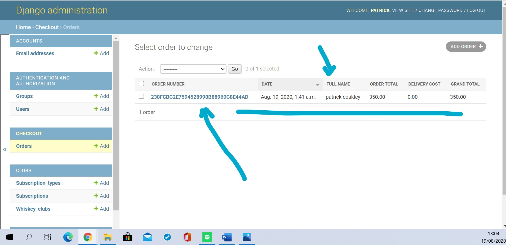</a>

I can edit objects in the admin. 

User Story 9 **Update** <strong>(Click dropdown for images)</strong>

  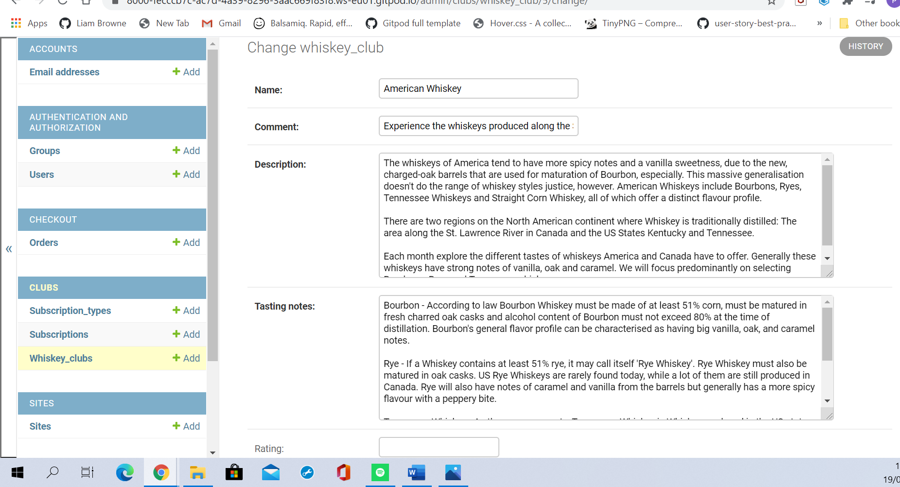</a>

And finally I can delete things like whiskey clubs, subscription plans, orders etc 

User Story 9 **Delete** <strong>(Click dropdown for images)</strong>

  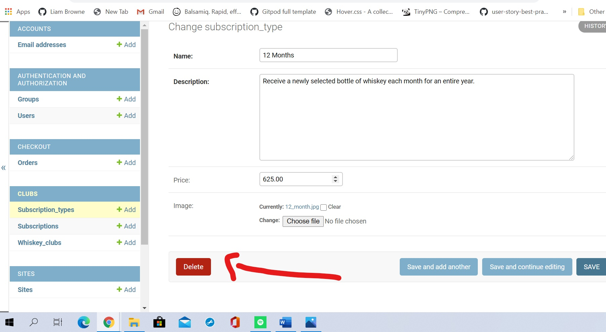</a>

## Further Testing 

### Webhooks 

I tested webhooks by checking if they were received on their server. 
I removed the form.submit(); from the stripe_elements.js in order to replicate the instance of a user entering their card details, then clicking the complete order button, and then a user unknowingly or knowingly redirecting away before the form can be submitted and the user redirected to the checkout success page.
what would happen in this situation without webhooks would be the consumer would pay for the order but Angel Share wouldn't recieve the order on their side to activate the subscription and deliver the whiskey. 

Webhook testing<strong>(Click dropdown for images)</strong>

  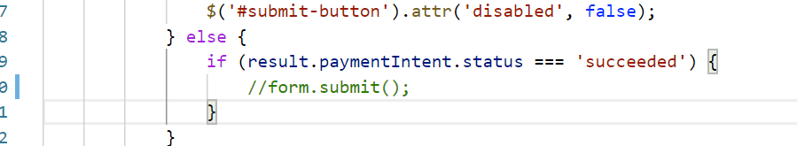</a>

  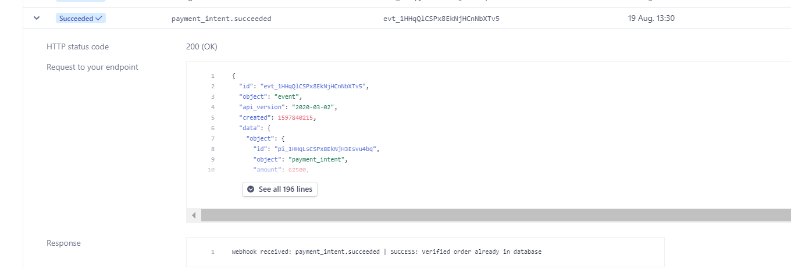</a>

  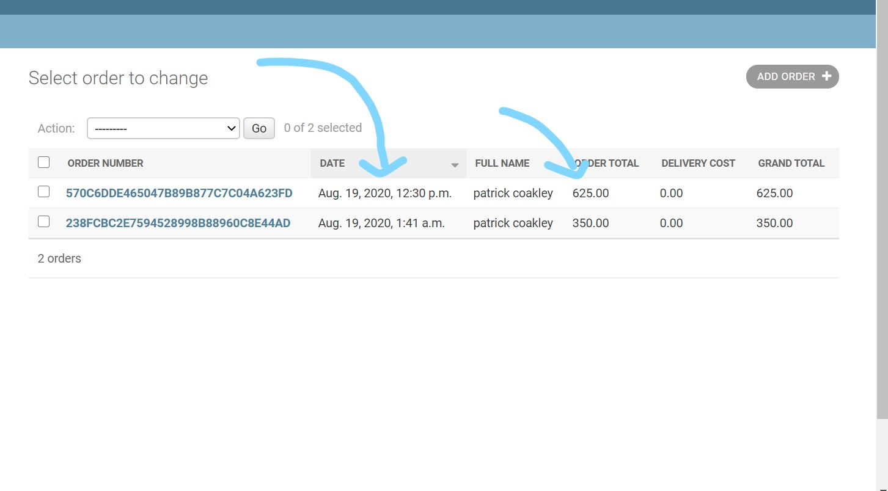</a>

### Access Denied
I carried out several testing of trying to access pages a user shouldn't be allowed to. 

Here is a few of the defensive designs I have implemented to my website.:

1. A user can't have two of the of the same Whiskey Clubs in the shopping cart, as I don't want to have a messy situation where users can have two subscriptions to the same club. 
I also test to see if the user already has an order in our system for that subscription, and if so, prevents them from adding the club to the cart.
Users are allowed have a subscription to different clubs. So it is possible a user has a subscription plan to all three of the whiskey clubs.

Webhook testing<strong>(Click dropdown for images)</strong>

  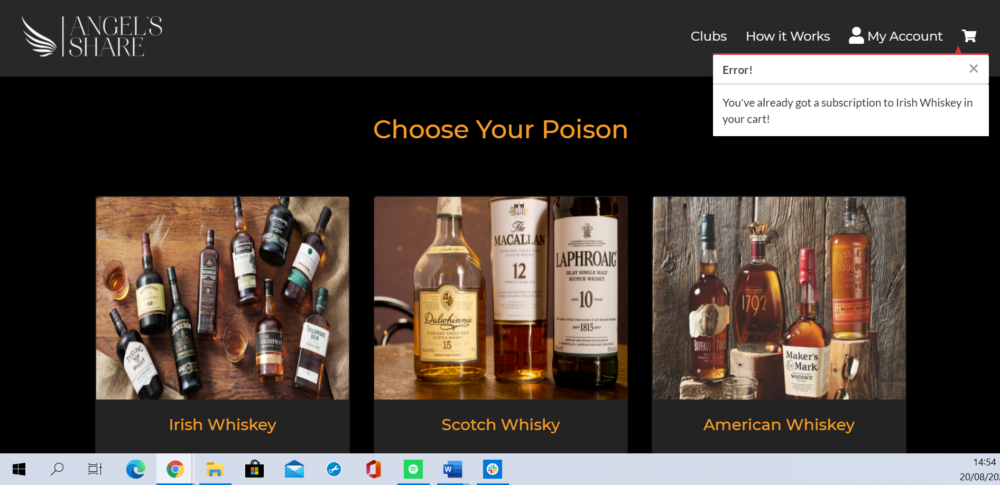</a>

  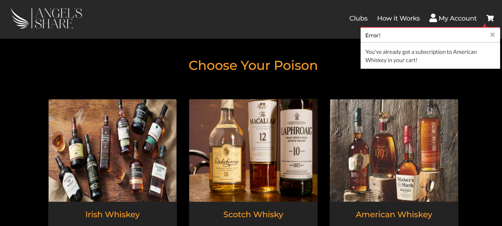</a>

2. Authentication is required to add items to the cart, and if users are not logged in they are redirected to the login page with the appropriate message. 

Webhook testing<strong>(Click dropdown for images)</strong>

  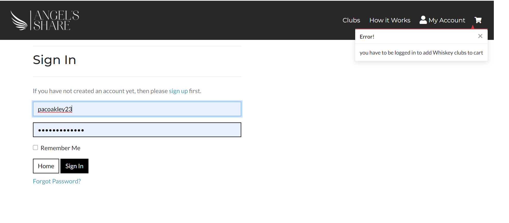</a>

## SCHEMA 
<h2 align="center">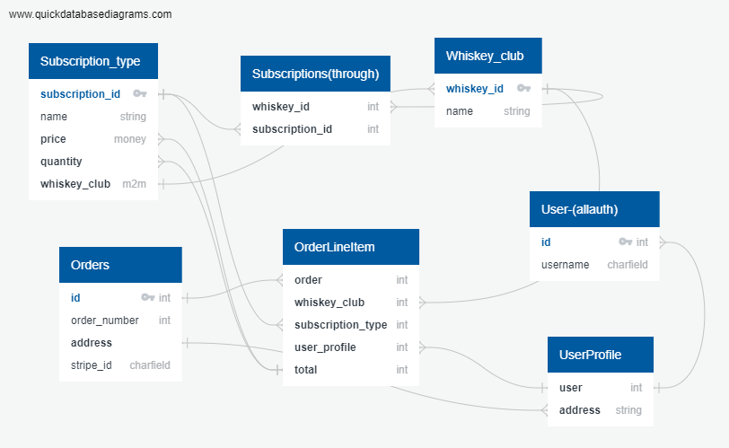</h2>
In development I used the relational database SQLite which is set up as default in Django. 

Firstly within my Clubs app I have my two models Whiskey_Clubs and Subscription_type which have a many to many relationship, as a club can have many subscriptions and also a subscription may have many clubs. 
The Subscriptions model is the through table which consists of the foreign keys to both the Whiskey_club and Subscription type. 

This relationship allowed me to append these two objects together when after user selected their club and subscription.

for club_id, club_details in cart.items():

{'1':{'sub_id':4', 'quantity':1}} - so this is what gets added to the cart. Whiskey_club.id of 1 , sub_id of 4 and quantity of 1. I realized afterwards, that I could have left out the quantity
as I always want it to be 1 as it makes no sense for a user to sign up to two of the same subscriptions. 

---
OrderModel and UserProfiles are related due to the UserProfile foreign key within the OrderLineItem. This facilitates us checking the database to see if a user already has a subscription to that specific whiskey club before adding it to the cart. Because of the foreign key relationship it allows us to pre populate the forms 
when the user clicks the save(info) button when checking out or when they click update details in the profile app. 

* When user clicks update information in the profiles app, this pre populates the delivery details in the order form when the user checks out. 
* When the user clicks save info when entering the delivery details in the checkout, this updates the information in the profiles form. 

This is how the Angel's Share database is organised and how the relations among them are associated.

## DEPLOYMENT
I first set up my repository on Github. Github is a hosting platform which stores and presents my code. When logged into GitHub I click the green button on the right handside under repositories to create a new repository. After creating a repository on github I click the green 'Gitpod' button which opens my repository in Gitpod. I don't ever create projects directly in Gitpod, I create them in Github, and use the green button to open my project and begin coding.

Gitpod is an IDE (integrated development environment) that allows for software development.
Once I have inserted some code, I can run my page in the browser and within seconds, I can view the web version of my page. Gitpod is where I develop my project, write code and complete debugging issues.

An important note, after I have created the repo in Github, I then open the repository each time from the Gitpod homepage, which shows me my most recent workspaces. If I were to click the green button in Github every time, this would just create a new version of my repository each time.

In Gitpod, the next step is to commit any significant work and push it to Github.

### Installing Django 
Once I had my gitpod workspace set up I then progressed to installing django. I used the [Code Institute Full template]( https://github.com/Code-Institute-Org/gitpod-full-template) 
so pip, python3 and Git were already installed on my workspace. Below are the steps to get started with Django. 

** In the terminal** follow the steps below:

1.       pip3 install django

2.       django-admin startproject angels-share .

    * The dot at the end just means to set up this django app in the current directory
    ** where I have 'angels-share' you can enter whatever name you'd like for your django app. 

3.      touch .gitignore

    * In this file I added:  *.sqlite3 (this is to ignore my database file)
    * *.pyc
    * __pycache__ (these two are to ignore any compiled python code)

4.      python3 manage.py runserver 

    * I exposed port 8000 here, and I am prompted with the below page indicating I installed django successfully. 

<h2 align="center"></h2>

5. * Then stop the server and go back to the terminal 

        python3 manage.py migrate

    *this is to make the inital migrations. 

6. * We can then create a superuser

        python3 manage.py createsuperuser

    * enter your username, email and password. 

From here I was able to get started on my project, install apps, create my views, models, urls etc. 

This project it is hosted on [Heroku]( https://signup.heroku.com/?c=70130000000NeLCAA0&gclid=Cj0KCQjwjer4BRCZARIsABK4QeUrUsqWM9q6V3aC9FczWoV80QkJn_rR-MNe3GDdz7XdQsVdGUbv3X8aAufJEALw_wcB) and I have outlined below how to deploy your project on Heroku.

### Heroku Deployment 
To deploy a Django project to heroku, follow the steps I took below:

1. Create a new app on the [Heroku Website]( https://signup.heroku.com/?c=70130000000NeLCAA0&gclid=Cj0KCQjwjer4BRCZARIsABK4QeUrUsqWM9q6V3aC9FczWoV80QkJn_rR-MNe3GDdz7XdQsVdGUbv3X8aAufJEALw_wcB)
Give it a name and set the region to whichever is applicable for your location.

2. I used a [Postgres](https://www.postgresql.org/) database for my django app when hosted on heroku. 
In heroku I clicked the **Resources** tab and searched for Postgres in the addons.
Once added I clicked the **Settings** tab and within the **config vars** section I can access my Postgres Url. 

3. Over in the Gitpod workspace terminal install dj_database_url, and psycopg2. 

        pip3 install dj_database_url

        pip3 install psycopg2-binary

4. Create a `requirements.txt` file using the terminal command `pip freeze > requirements.txt`

    * to update the requirements folder after further downloads type the same command. 

5. I then import dj_database_url to my settings.py file and changed my database to

    DATABASES = {
        'default': dj_database_url.parse('<enter postgres url here as mentioned in step 2>'))
    }

6. Migrate changes to Postgres. 

                python3 manage.py migrate

    ** can then create a superuser again for the postgres admin

7. Intall gunicorn to act as webserver 

        pip3 install unicorn 

    * then freeze requirements

8. Create a `Procfile` with the terminal command `echo web: python app.py > Procfile`.

9. `git add` and `git commit` the new requirements and Procfile and then `git push` the project to GitHub.

10. From the heroku dashboard of your newly created application, click on "Deploy" > "Deployment method" and select GitHub.

11. Confirm the linking of the heroku app to the correct GitHub repository.

12. I set up [Amazon Webservers](https://aws.amazon.com/) to host my media and static files. (S3)[https://aws.amazon.com/s3/) Simple Storage Service is the service app I used to store my static files like JavaScript and CSS and my images. 

    * [Here] is a link on how to set up an S3 bucket. 

13. Within my config vars in heroku I made sure it had my AWS Access keys, Secret keys, stripes keys etc. 

<h2 align="center">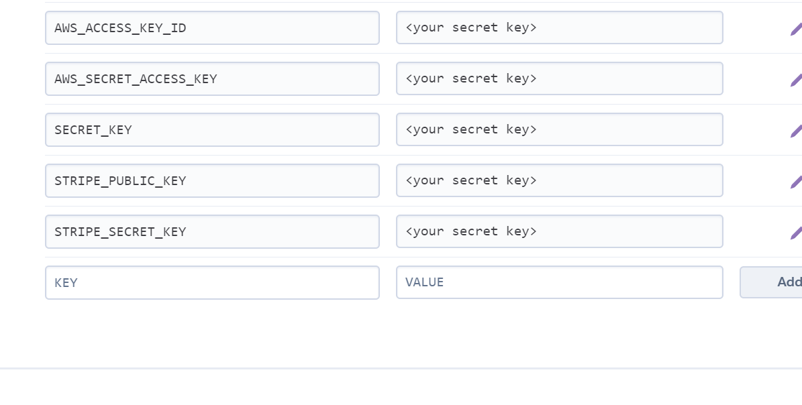</h2>

### How to run this project locally
To run this project on your own IDE follow the instructions below. Ensure you have an IDE such as GitPod and the following installed:

1. PIP
2. Git
3. Python3
4. If you are using the [Code Institute Full template]( https://github.com/Code-Institute-Org/gitpod-full-template) the above will already be installed

6. To allow you to access all functionality on the site locally, ensure you have created free accounts with the following services:
    - [Stripe](https://dashboard.stripe.com/register)
    - [AWS](https://aws.amazon.com/) and [set up an S3 bucket](https://docs.aws.amazon.com/AmazonS3/latest/gsg/CreatingABucket.html)
    - Set up SMTP server with a [Gmail](https://mail.google.com/) account for automatic emails. Steps to download [here]( https://www.siteground.com/kb/google_free_smtp_server/) 

#### Instructions
1. Save a copy of the github repository located at https://github.com/PatrickCoakley23/Angels_Share

    * Click on the "Clone or download" green button located above and to the right of the File Structure table.
    *Click on the "clipboard icon" to the right of the Git URL to copy the web URL of the Clone.

2.        git clone https://github.com/PatrickCoakley23/Angels_Share

        * enter the Git url you copied in step one. 

3.  In the settings.py file set your AWS Bucket name and allowed hosts.

4. Locate your settings file for storing enivonment variables. If using Gitpod it is located in the settings dropdown from https://gitpod.io/workspaces/. 
Do not forget to restart your machine to activate your environment variables or your code will not be able to see them:

Set the variables to match the names in Angels_Share Workspace. 

        {
    
    "DEV": "1",
    "M4SECRET_KEY": "<enter key here>",
    "STRIPE_PUBLIC_KEY": "<enter key here>",
    "STRIPE_SECRET_KEY": "<enter key here>",
    "M4SECRET_KEY": "<enter key here>",
}

5. Migrate the admin panel models to create your database template with the terminal command

         python3 manage.py migrate

    *this is to make the inital migrations. 

6. * We can then create a superuser

        python3 manage.py createsuperuser

    * enter your username, email and password. 

#### Heroku Deployment 

To deploy Angel's Share to heroku, take the following steps:

1. Create a `requirements.txt` file using the terminal command `pip freeze > requirements.txt`.

2. Create a `Procfile` with the terminal command `echo web: python app.py > Procfile`.

3. `git add` and `git commit` the new requirements and Procfile and then `git push` the project to GitHub.

3. Create a new app on the [Heroku website](https://dashboard.heroku.com/apps) by clicking the "New" button in your dashboard. Give it a name and set the region to whichever is applicable for your location.

4. From the heroku dashboard of your newly created application, click on "Deploy" > "Deployment method" and select GitHub.

5. Confirm the linking of the heroku app to the correct GitHub repository.

6. In the heroku dashboard for the application, click on "Settings" > "Reveal Config Vars".

7. Set the following config vars:

<h2 align="center">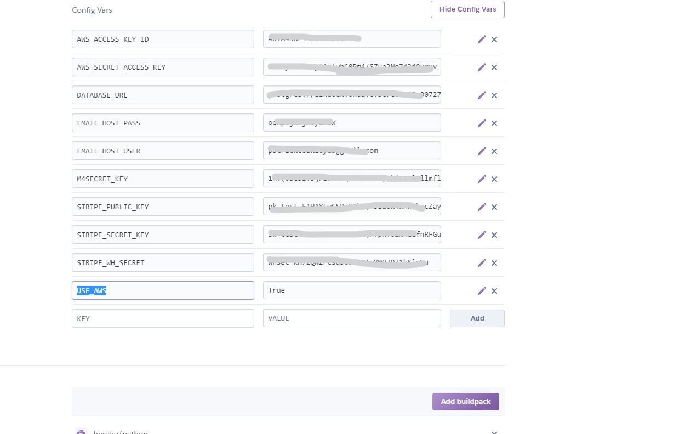</h2>

8.  Once instances of these items exist in your database your heroku site will run as expected.

## Credits

### Media 
- The **Angel's Drop** logo was created using [Tailor Brands]( https://www.tailorbrands.com/).
- [Font Awesome]( https://fontawesome.com/start) was the source of all the icons. 
- All of the images were sourced from these [whiskey images]( https://www.shutterstock.com/search/whiskey) from [Shutterstock]( https://www.shutterstock.com/).

### Content 
- Some of the content about Irish Whiskey was inspired or copied directly from this article post titled [An introduction to Irish Whiskey](https://www.primermagazine.com/2013/live/an-introduction-to-irish-whiskey#:~:text=Smooth%20and%20sweet%2C%20the%20nose,over%20heavily%20into%20the%20taste.&text=The%20whiskey%20finishes%20long%2C%20warm%2C%20and%20spicy.) from [Primer Magazine](https://www.primermagazine.com/)
- The content about American Whiskey was inspired or copied directly from this article titled [American Whiskey]( https://www.whisky.com/information/knowledge/production/types-of-whiskies/american-whiskey.html) from [Whisky.com]( https://www.whisky.com/)
- The content about Scottish Whisky was inspired or copied directly from this post titled [The Scotch Whisky Guide]( https://www.gentlemansgazette.com/the-scotch-whisky-guide/) from the [Gentleman's Gazette]( https://www.gentlemansgazette.com/).

## ACKNOWLEDGEMENTS
- My mentor, [Precious Ijege]( https://github.com/precious-ijege) was a great help. The three mentor sessions were invaluable. He explained every suggestion in a clear concise manner, and pointed out bugs i would never have seen.

- My tutor, [Cormac Lawlor]( https://github.com/armedcor) was very supportive during the project. Being a past student himself, he was aware of certain issues i was facing and was always at hand to offer support. 

- [Chris Zielinski]( https://github.com/ckz8780) - Chris developed a brilliant project boutique ado in the code institute course module for django. The project was so extensive i was able to reuse some of the apps in this project by adding my own customization. 
